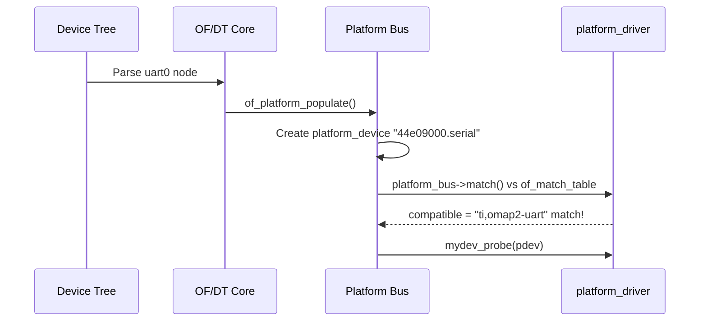

# 04 — Platform Devices

## 1. What are Platform Devices?

**Platform devices** are processors-integrated peripherals that are **not auto-discoverable** (unlike PCI/USB):
- UARTs, I2C controllers, GPIO controllers, timers, watchdogs
- Described via **Device Tree** (DT) or ACPI on embedded/ARM systems
- Registered manually on x86 legacy systems

---

## 2. Core Structures

```c
/* A platform_device represents one device instance */
struct platform_device {
    const char      *name;          /* Device name → match with driver */
    int             id;             /* Instance number (-1 = single) */
    bool            id_auto;
    struct device   dev;            /* Embedded device */
    u64             platform_dma_mask;
    struct device_dma_parameters dma_parms;
    u32             num_resources;
    struct resource *resource;      /* Memory regions, IRQs, DMA */
    const struct platform_device_id *id_entry;
    const char      *driver_override; /* Force specific driver */
    struct mfd_cell *mfd_cell;         /* If from MFD */
    struct pdev_archdata archdata;
};

/* A platform_driver handles matching platform_devices */
struct platform_driver {
    int (*probe)(struct platform_device *);
    int (*remove)(struct platform_device *);
    void (*shutdown)(struct platform_device *);
    int (*suspend)(struct platform_device *, pm_message_t state);
    int (*resume)(struct platform_device *);
    struct device_driver driver;
    const struct platform_device_id *id_table;  /* Name matching */
    bool prevent_deferred_probe;
};
```

---

## 3. Platform Driver Registration

```c
#include <linux/platform_device.h>

static int mydev_probe(struct platform_device *pdev)
{
    struct resource *res;
    void __iomem *base;
    int irq;

    /* Get memory resource */
    res = platform_get_resource(pdev, IORESOURCE_MEM, 0);
    base = devm_ioremap_resource(&pdev->dev, res);
    if (IS_ERR(base))
        return PTR_ERR(base);

    /* Get IRQ resource */
    irq = platform_get_irq(pdev, 0);
    if (irq < 0)
        return irq;

    /* Register IRQ */
    devm_request_irq(&pdev->dev, irq, mydev_irq, 0, "mydev", pdev);

    platform_set_drvdata(pdev, mypriv);
    return 0;
}

static int mydev_remove(struct platform_device *pdev)
{
    /* devm_* resources freed automatically */
    return 0;
}

static const struct of_device_id mydev_of_match[] = {
    { .compatible = "vendor,mydev-v1" },
    { /* sentinel */ }
};
MODULE_DEVICE_TABLE(of, mydev_of_match);

static struct platform_driver mydev_driver = {
    .probe  = mydev_probe,
    .remove = mydev_remove,
    .driver = {
        .name           = "mydev",
        .of_match_table = mydev_of_match,
        .pm             = &mydev_pm_ops,
    },
};

module_platform_driver(mydev_driver);   /* Registers init/exit automatically */
```

---

## 4. Device Tree → Platform Device

```dts
/* arch/arm/boot/dts/myboard.dts */
uart0: serial@44e09000 {
    compatible = "ti,am3352-uart", "ti,omap2-uart";
    reg = <0x44e09000 0x2000>;
    interrupts = <72>;
    clocks = <&uart0_fck>;
    clock-names = "fck";
};
```



---

## 5. Resources

```c
/* Defined in platform_device.resource[] or DT */
struct resource {
    resource_size_t start;  /* Base address */
    resource_size_t end;    /* End address (inclusive) */
    const char     *name;
    unsigned long   flags;  /* IORESOURCE_MEM, IORESOURCE_IRQ, etc. */
};
```

---

## 6. Source Files

| File | Description |
|------|-------------|
| `drivers/base/platform.c` | Platform bus, probe, match |
| `include/linux/platform_device.h` | All platform structs |
| `drivers/of/platform.c` | Device Tree → platform_device |

---

## 7. Related Topics
- [01_Device_Model.md](./01_Device_Model.md)
- [05_Module_Loading.md](./05_Module_Loading.md)
