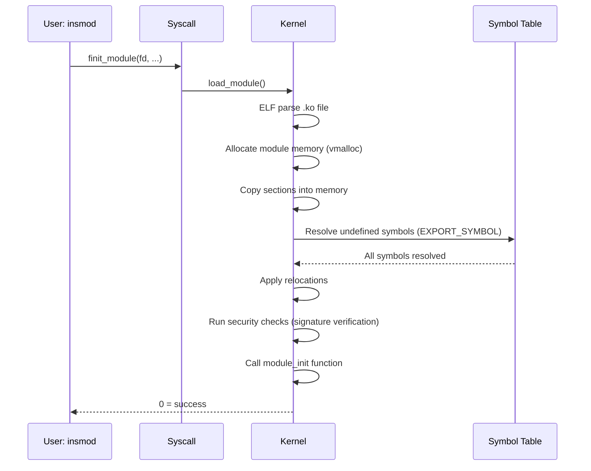

# 05 — Module Loading

## 1. What is a Kernel Module?

A **loadable kernel module (LKM)** is a piece of kernel code that can be **dynamically loaded and unloaded** at runtime without rebooting.

```bash
# Load module
modprobe e1000e            # Load with dependencies
insmod ./mydriver.ko       # Load from file

# Unload module
modprobe -r e1000e
rmmod mydriver

# List loaded modules
lsmod
# Module                  Size  Used by
# e1000e               290816  0
# ptp                   28672  1 e1000e
```

---

## 2. Module Structure

```c
#include <linux/module.h>
#include <linux/init.h>
#include <linux/kernel.h>

static int __init mymod_init(void)
{
    pr_info("mymod: loaded\n");
    return 0;   /* 0 = success; negative = error, module not loaded */
}

static void __exit mymod_exit(void)
{
    pr_info("mymod: unloaded\n");
}

module_init(mymod_init);
module_exit(mymod_exit);

MODULE_LICENSE("GPL");
MODULE_AUTHOR("Your Name <email@example.com>");
MODULE_DESCRIPTION("Example kernel module");
MODULE_VERSION("1.0");
```

---

## 3. Module Loading Flow



---

## 4. EXPORT_SYMBOL

```c
/* In module/core kernel — export a symbol for other modules */
int my_kernel_function(int x) { return x * 2; }
EXPORT_SYMBOL(my_kernel_function);         /* GPL + proprietary */
EXPORT_SYMBOL_GPL(my_kernel_function);     /* GPL only */

/* In another module — use it */
extern int my_kernel_function(int x);
/* or just call it if declared in a header */
```

---

## 5. Module Dependencies (modprobe)

```bash
# View module dependencies:
modinfo e1000e
# depends: ptp,i2c-smbus

# depmod generates /lib/modules/$(uname -r)/modules.dep
depmod -a

# modprobe reads deps and loads in order:
modprobe e1000e   # Automatically loads ptp and i2c-smbus first
```

---

## 6. Module Memory Layout

```c
struct module {
    enum module_state   state;       /* MODULE_STATE_LIVE/COMING/GOING */
    struct list_head    list;        /* All modules list */
    char                name[MODULE_NAME_LEN];
    const struct kernel_symbol *syms;      /* Exported symbols */
    unsigned int        num_syms;
    const s32           *crcs;             /* Symbol CRCs */
    struct module_layout core_layout;     /* .text, .rodata */
    struct module_layout init_layout;     /* .init.text (freed after init) */
    /* ... */
};
```

---

## 7. __init and __exit Sections

```c
/* __init section: freed after module is initialized */
static int __init mymod_init(void)  { ... }

/* __exit section: only compiled if CONFIG_MODULE_UNLOAD */
static void __exit mymod_exit(void) { ... }

/* __initdata: freed after init, for data */
static int __initdata init_value = 42;
```

---

## 8. Source Files

| File | Description |
|------|-------------|
| `kernel/module/` | Module loading, unloading |
| `kernel/module/main.c` | load_module(), sys_init_module |
| `include/linux/module.h` | MODULE_* macros, EXPORT_SYMBOL |
| `scripts/mod/modpost.c` | Build-time module post-processing |

---

## 9. Related Topics
- [06_Module_Parameters.md](./06_Module_Parameters.md)
- [04_Platform_Devices.md](./04_Platform_Devices.md)
