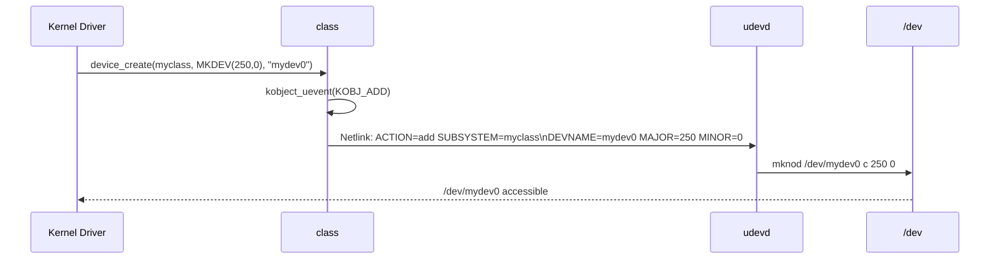

# 07 — Device Classes

## 1. What is a Device Class?

A **device class** groups devices by type/function rather than by hardware bus:
- `/sys/class/net/` — all network interfaces
- `/sys/class/input/` — keyboards, mice, joysticks
- `/sys/class/tty/` — serial ports, terminals
- `/sys/class/block/` — block devices

Creates `/dev` nodes via udev rules based on class.

---

## 2. struct class

```c
/* include/linux/device/class.h */
struct class {
    const char          *name;       /* Class name (e.g., "net") */
    struct module       *owner;
    const struct attribute_group **class_groups;
    const struct attribute_group **dev_groups;  /* Per-device attrs */
    const struct attribute_group **drv_groups;  /* Per-driver attrs */

    int (*dev_uevent)(const struct device *dev, struct kobj_uevent_env *env);
    char *(*devnode)(const struct device *dev, umode_t *mode);

    void (*class_release)(struct class *class);
    void (*dev_release)(struct device *dev);

    int (*shutdown_pre)(struct device *dev);

    const struct kobj_ns_type_operations *ns_type;
    const void *(*namespace)(const struct device *dev);
    void (*get_ownership)(const struct device *dev, kuid_t *uid, kgid_t *gid);

    const struct dev_pm_ops *pm;
};
```

---

## 3. Creating a Device Class

```c
/* Register a new class */
static struct class *myclass;

myclass = class_create(THIS_MODULE, "myclass");
if (IS_ERR(myclass)) {
    return PTR_ERR(myclass);
}

/* Create a device in that class → /dev/mydev0 */
struct device *dev = device_create(myclass, NULL,
            MKDEV(major, 0),  /* dev_t major:minor */
            NULL,             /* drvdata */
            "mydev%d", 0);    /* name format */

/* In cleanup: */
device_destroy(myclass, MKDEV(major, 0));
class_destroy(myclass);
```

---

## 4. Class Attributes

```c
/* Class-level attributes in /sys/class/myclass/ */
static ssize_t version_show(const struct class *cls,
                             const struct class_attribute *attr, char *buf)
{
    return sysfs_emit(buf, "1.0\n");
}

static CLASS_ATTR_RO(version);

static struct attribute *myclass_attrs[] = {
    &class_attr_version.attr,
    NULL
};
ATTRIBUTE_GROUPS(myclass);

myclass->class_groups = myclass_groups;
```

---

## 5. Real Kernel Examples

```c
/* net/core/net-sysfs.c */
struct class net_class = {
    .name       = "net",
    .dev_release = net_release,
    .dev_groups  = net_class_groups,
    .dev_uevent  = netdev_uevent,
    .ns_type     = &net_ns_type_ops,
    .namespace   = net_namespace,
};

/* drivers/input/input.c */
struct class input_class = {
    .name           = "input",
    .devnode        = input_devnode,
};
```

---

## 6. /dev Node Creation Flow



---

## 7. Source Files

| File | Description |
|------|-------------|
| `drivers/base/class.c` | class_create, device_create |
| `include/linux/device/class.h` | struct class |
| `drivers/net/` | Network class usage |
| `drivers/input/input.c` | Input class usage |

---

## 8. Related Topics
- [01_Device_Model.md](./01_Device_Model.md)
- [03_sysfs.md](./03_sysfs.md)
- [05_Module_Loading.md](./05_Module_Loading.md)
