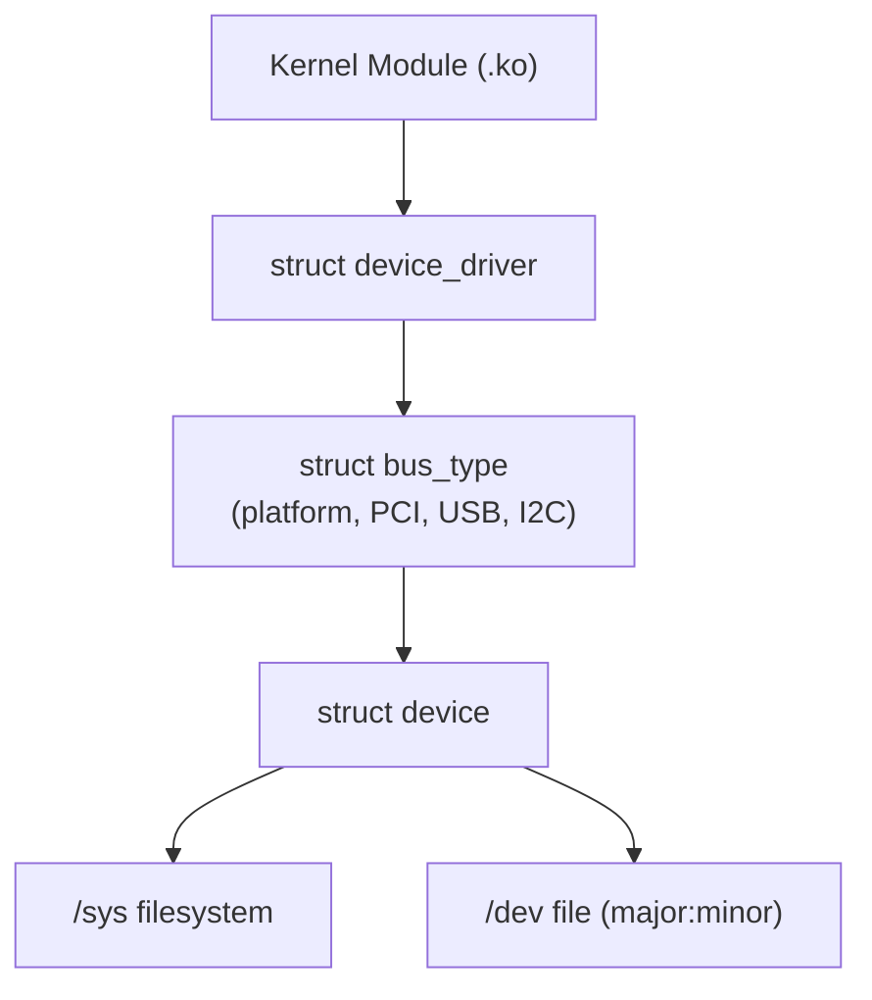

# Chapter 16 — Devices and Modules

## Overview

Linux uses a **unified device model** built around `kobject`, `sysfs`, and bus/driver frameworks.

## Topics

1. [01_Device_Model.md](./01_Device_Model.md)
2. [02_kobject.md](./02_kobject.md)
3. [03_sysfs.md](./03_sysfs.md)
4. [04_Platform_Devices.md](./04_Platform_Devices.md)
5. [05_Module_Loading.md](./05_Module_Loading.md)
6. [06_Module_Parameters.md](./06_Module_Parameters.md)
7. [07_Device_Classes.md](./07_Device_Classes.md)
