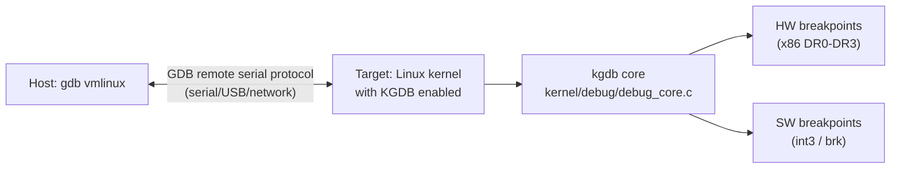

# 02 — KGDB

## 1. What is KGDB?

**KGDB** (Kernel GDB) is an in-kernel debugger that allows using **GDB** to debug a running Linux kernel — including setting breakpoints, inspecting variables, and stepping through code.

Requires:
- Two machines (target to debug + host running gdb)
- Or using QEMU with `-s -S` flags for single-machine testing

---

## 2. Architecture



---

## 3. Kernel Config

```bash
# Required config options:
CONFIG_KGDB=y
CONFIG_KGDB_SERIAL_CONSOLE=y   # or CONFIG_KGDB_KDB for keyboard debugger
CONFIG_DEBUG_INFO=y             # Generate debug symbols
CONFIG_FRAME_POINTER=y         # Better stack traces
CONFIG_MAGIC_SYSRQ=y           # For sysrq-g trigger
```

---

## 4. Setup: QEMU + GDB

```bash
# Launch QEMU with GDB stub enabled:
qemu-system-x86_64 \
    -kernel arch/x86/boot/bzImage \
    -s            \   # Start GDB server on :1234
    -S            \   # Pause at startup
    -append "kgdbwait kgdboc=ttyS0,115200 console=ttyS0" \
    ...

# On host: connect GDB
gdb vmlinux
(gdb) target remote :1234
(gdb) break start_kernel
(gdb) continue
```

---

## 5. KGDB Commands Inside GDB

```gdb
# Connect to target
(gdb) target remote /dev/ttyS0  # Or :1234 for QEMU

# Set breakpoint
(gdb) break do_page_fault
(gdb) break mm/memory.c:1234

# Watchpoint (break on variable write)
(gdb) watch current->mm

# Print kernel variables
(gdb) print init_task
(gdb) print jiffies
(gdb) print *current

# Backtrace
(gdb) bt
(gdb) bt full   # With local variables

# Step execution
(gdb) next
(gdb) step
(gdb) continue
```

---

## 6. Triggering KGDB Entry

```bash
# Method 1: SysRq
echo g > /proc/sysrq-trigger    # On target

# Method 2: Kernel code
BREAKPOINT();   /* arch/x86/include/asm/kgdb.h */

# Method 3: kgdbwait boot param — waits for GDB at boot
```

---

## 7. KDB — Built-in Keyboard Debugger

```bash
# Alternative to KGDB (no second machine needed):
CONFIG_KGDB_KDB=y

# Trigger from keyboard (if CONFIG_MAGIC_SYSRQ):
Alt + SysRq + g   # Enter KDB
```

```
kdb> help           # List commands  
kdb> bt             # Backtrace
kdb> ps             # Show processes
kdb> lsmod          # List modules
kdb> md 0xffff... 8 # Memory dump
kdb> go             # Continue
```

---

## 8. Source Files

| File | Description |
|------|-------------|
| `kernel/debug/debug_core.c` | KGDB core |
| `kernel/debug/kdb/` | KDB implementation |
| `arch/x86/kernel/kgdb.c` | x86 breakpoint support |
| `Documentation/dev-tools/kgdb.rst` | Complete documentation |

---

## 9. Related Topics
- [01_printk.md](./01_printk.md)
- [03_KASAN_KCSAN.md](./03_KASAN_KCSAN.md)
- [04_ftrace.md](./04_ftrace.md)
