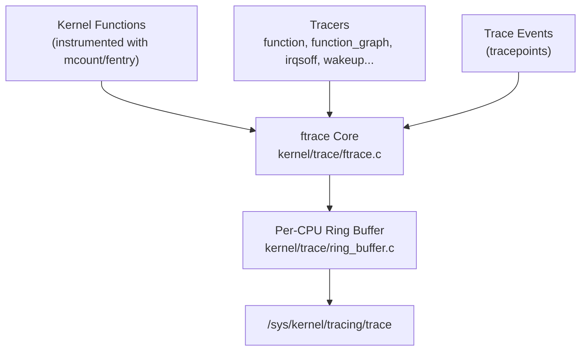

# 04 — ftrace

## 1. What is ftrace?

**ftrace** is the kernel's built-in function tracer — it can trace every kernel function call, measure latencies, and track events with near-zero overhead.

Mounted at `/sys/kernel/tracing/` (or `/sys/kernel/debug/tracing/`).

---

## 2. ftrace Architecture



---

## 3. Basic Usage

```bash
# Mount tracefs (usually auto-mounted):
mount -t tracefs tracefs /sys/kernel/tracing

cd /sys/kernel/tracing

# List available tracers:
cat available_tracers
# blk function_graph wakeup_dl wakeup_rt wakeup irqsoff function nop

# Enable function tracer:
echo function > current_tracer

# Start/stop tracing:
echo 1 > tracing_on
# ... do something ...
echo 0 > tracing_on

# Read trace:
cat trace | head -50
```

---

## 4. function_graph Tracer

```bash
echo function_graph > current_tracer
echo 1 > tracing_on
ls /proc/
echo 0 > tracing_on
cat trace | head -40
```

Output:
```
 0)               |  sys_getdents64() {
 0)               |    iterate_dir() {
 0)               |      ext4_readdir() {
 0)   1.234 us    |        ext4_find_entry();
 0)   0.456 us    |        ext4_get_inode_loc();
 0)               |      }
 0)   3.012 us    |    }
 0)   4.100 us    |  }
```

---

## 5. Filter by Function

```bash
# Trace only one function:
echo "do_page_fault" > set_ftrace_filter

# Trace a module:
echo ":mod:mydriver" > set_ftrace_filter

# Trace a subtree (all functions starting with "ext4"):
echo "ext4*" > set_ftrace_filter

# Clear filter (trace all):
echo > set_ftrace_filter
```

---

## 6. Trace Events (Tracepoints)

```bash
# List available events:
ls /sys/kernel/tracing/events/

# Enable a specific event:
echo 1 > /sys/kernel/tracing/events/sched/sched_switch/enable
echo 1 > /sys/kernel/tracing/events/block/block_rq_issue/enable

# View event format:
cat /sys/kernel/tracing/events/sched/sched_switch/format

# Trace output with events:
echo 1 > tracing_on
cat trace | grep sched_switch
```

---

## 7. Latency Tracers

```bash
# irqsoff: Measure max interrupt-disabled latency:
echo irqsoff > current_tracer
echo 1 > tracing_on
# ... trigger some workload ...
cat trace   # Shows the worst latency spike and its call chain

# wakeup: Measure scheduler wakeup latency:
echo wakeup > current_tracer
```

---

## 8. trace-cmd (User Tool)

```bash
# Easier frontend for ftrace:
trace-cmd record -e sched:sched_switch -e irq:* sleep 5
trace-cmd report | head -100

# GUI via kernelshark:
kernelshark trace.dat
```

---

## 9. Adding Tracepoints to Your Code

```c
/* Define tracepoint in header: include/trace/events/mymod.h */
TRACE_EVENT(mymod_do_work,
    TP_PROTO(int id, unsigned long bytes),
    TP_ARGS(id, bytes),
    TP_STRUCT__entry(
        __field(int, id)
        __field(unsigned long, bytes)
    ),
    TP_fast_assign(
        __entry->id    = id;
        __entry->bytes = bytes;
    ),
    TP_printk("id=%d bytes=%lu", __entry->id, __entry->bytes)
);

/* In your code: */
#define CREATE_TRACE_POINTS
#include <trace/events/mymod.h>

trace_mymod_do_work(id, bytes);  /* Zero cost when disabled */
```

---

## 10. Source Files

| File | Description |
|------|-------------|
| `kernel/trace/ftrace.c` | Core function tracer |
| `kernel/trace/trace.c` | Trace infrastructure |
| `kernel/trace/ring_buffer.c` | Per-CPU ring buffer |
| `include/trace/events/` | All kernel tracepoints |
| `Documentation/trace/ftrace.rst` | Full documentation |

---

## 11. Related Topics
- [05_perf.md](./05_perf.md)
- [06_Dynamic_Debug.md](./06_Dynamic_Debug.md)
