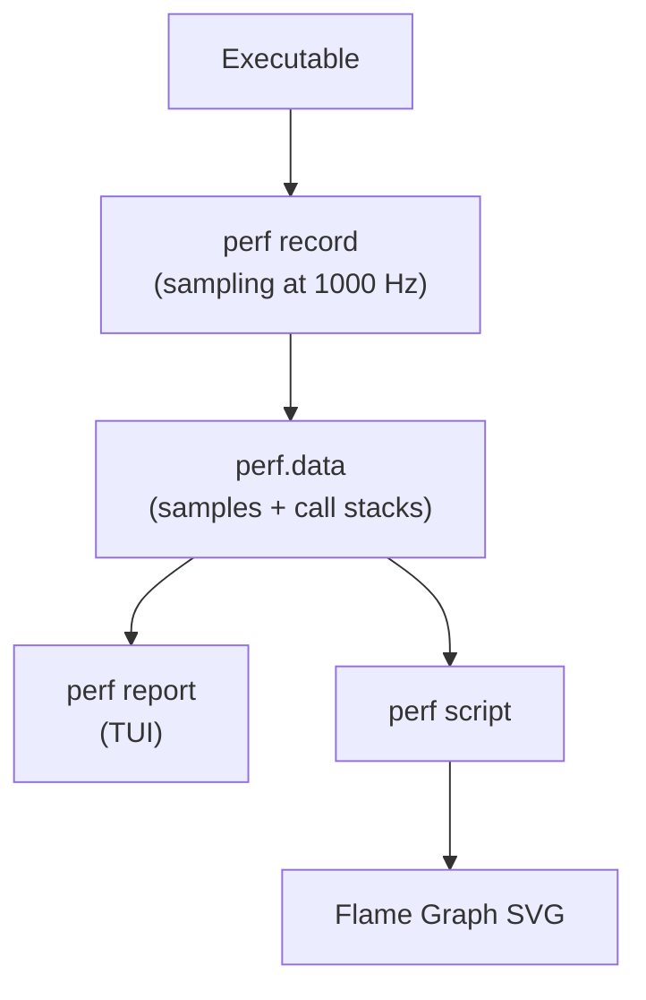

# 05 — perf

## 1. What is perf?

`perf` is the Linux performance analysis tool. Uses **hardware performance counters** (PMU), kernel tracepoints, and software events.

Can profile:
- CPU cycles, cache misses, branch mispredictions
- Kernel function hotspots
- Scheduler and I/O latency
- Lock contention

---

## 2. Basic Commands

```bash
# Count events for a command:
perf stat ls -la
# Performance counter stats for 'ls -la':
#   1,234,567  cycles
#   8,901,234  instructions  #  7.22  insn per cycle
#      56,789  cache-misses  #  0.45% of all cache refs

# Profile system-wide for 30 seconds:
perf top

# Record a profile:
perf record ./mybinary arg1 arg2
perf record -g ./mybinary      # With call graphs (-g = frame pointer)
perf record -g -F 999 -a sleep 10  # System-wide at 999 Hz for 10s

# View the profile:
perf report
perf report --no-children      # Per-function (not cumulative)
```

---

## 3. perf stat Output

```
 Performance counter stats for 'dd if=/dev/zero of=/dev/null count=1000000':

       2,345,678 cycles                    #    3.40 GHz
       8,901,234 instructions              #    3.80  insn per cycle
         789,012 cache-references          #  114.9 M/sec
          56,789 cache-misses              #    7.2% of all cache refs
          34,567 branch-misses             #    0.4% of all branches

       0.688919186 seconds time elapsed
```

---

## 4. Flame Graph Generation

```bash
# Record with call graphs:
perf record -g -p $(pgrep myprocess) sleep 30

# Convert to flamegraph:
perf script | stackcollapse-perf.pl | flamegraph.pl > out.svg

# Or use built-in:
perf report --stdio --no-children -g fractal,0,caller
```



---

## 5. Profiling Kernel Code

```bash
# Profile kernel functions (need root):
perf record -g -a --call-graph dwarf sleep 10
perf report --sort=dso,symbol | grep '\[kernel\]'

# Profile specific kernel function:
perf probe --add do_page_fault
perf record -e probe:do_page_fault -ag sleep 5
perf report
perf probe --del do_page_fault
```

---

## 6. Hardware Events

```bash
# List available events:
perf list

# Common hardware events:
perf stat -e cycles,instructions,cache-misses,branch-misses ./prog

# Memory access profiling:
perf mem record ./prog
perf mem report

# Cache hierarchy analysis (Intel PT or PEBS):
perf stat -e L1-dcache-loads,L1-dcache-load-misses,LLC-loads ./prog
```

---

## 7. perf trace (strace replacement)

```bash
# Trace system calls (faster than strace):
perf trace ls

# Trace specific syscall:
perf trace -e open,read,write ls

# Output:
# 0.000 ls/12345  openat(AT_FDCWD, "/etc/ld.so.cache", O_RDONLY|O_CLOEXEC) = 3
# 0.012 ls/12345  read(3, "\177ELF...", 832)                                = 832
```

---

## 8. Source Files

| File | Description |
|------|-------------|
| `tools/perf/` | perf userspace tool |
| `kernel/events/core.c` | Core perf event infrastructure |
| `arch/x86/events/` | x86 PMU drivers |
| `include/linux/perf_event.h` | perf_event structs |

---

## 9. Related Topics
- [04_ftrace.md](./04_ftrace.md)
- [../03_Process_Scheduling/02_CFS_Completely_Fair_Scheduler.md](../03_Process_Scheduling/02_CFS_Completely_Fair_Scheduler.md)
