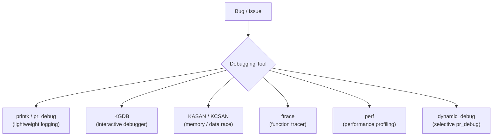

# Chapter 17 — Debugging

## Overview

Linux kernel provides powerful debugging tools from compile-time instrumentation to runtime tracers.

## Topics

1. [01_printk.md](./01_printk.md)
2. [02_KGDB.md](./02_KGDB.md)
3. [03_KASAN_KCSAN.md](./03_KASAN_KCSAN.md)
4. [04_ftrace.md](./04_ftrace.md)
5. [05_perf.md](./05_perf.md)
6. [06_Dynamic_Debug.md](./06_Dynamic_Debug.md)
