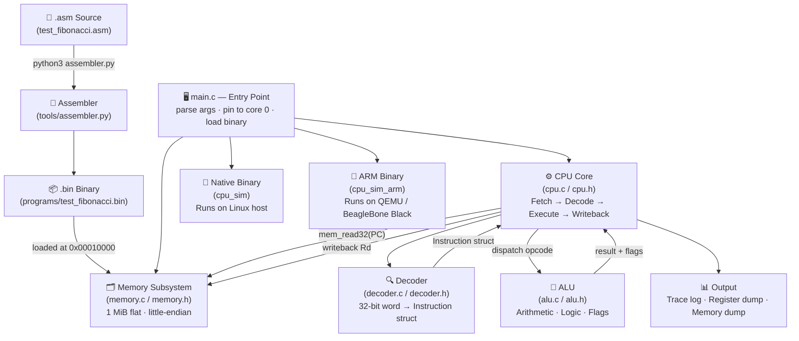

# Single-Threaded CPU Simulator — Architecture Overview

This document is the entry point for the architecture series. It describes what
was built, why each layer exists, and how all pieces fit together.

---

## What Was Built

A **fully self-contained, single-threaded CPU simulator** written in C.  
It models a minimal 32-bit RISC processor from scratch — meaning:

- A custom **Instruction Set Architecture (ISA)** with a fixed 32-bit encoding
- A **memory subsystem** (1 MiB flat address space, little-endian)
- A **register file** (R0–R15) with status flags (Z, N, C, O)
- A **decoder** that splits raw 32-bit words into typed instruction structs
- An **ALU** (Arithmetic Logic Unit) that performs all computations
- A **fetch → decode → execute → writeback** pipeline in a single loop
- A **Python assembler** that translates `.asm` text into loadable `.bin` files
- A **cross-compiled ARM binary** that can run inside QEMU or on real BeagleBone Black hardware

---

## System Layer Diagram



---

## Document Index

| # | Document | Layer | What It Covers |
|---|----------|-------|----------------|
| 01 | [01_ISA.md](./01_ISA.md) | **Specification** | Instruction encoding, opcode table, register aliases, addressing modes |
| 02 | [02_Memory_Model.md](./02_Memory_Model.md) | **Hardware Model** | 1 MiB flat memory, address map, R/W accessors |
| 03 | [03_ALU.md](./03_ALU.md) | **Compute Unit** | All arithmetic and logic operations, flag semantics |
| 04 | [04_Decoder.md](./04_Decoder.md) | **Decode Stage** | Bit extraction, sign extension, disassembler |
| 05 | [05_CPU_Core.md](./05_CPU_Core.md) | **Execution Engine** | State machine, 4-stage cycle, cpu_step / cpu_run |
| 06 | [06_Assembler.md](./06_Assembler.md) | **Toolchain** | Two-pass assembler, label resolution, syntax reference |
| 07 | [07_Toolchain_Build.md](./07_Toolchain_Build.md) | **Build System** | Makefile, native vs ARM cross-compilation, QEMU setup |
| 08 | [08_Fibonacci_Walkthrough.md](./08_Fibonacci_Walkthrough.md) | **End-to-End** | Step-by-step trace of Fibonacci execution |

---

## Design Philosophy

The simulator was designed with three core constraints:

1. **Truly single-threaded** — the host process is pinned to CPU core 0 via
   `sched_setaffinity()`, so there is no hidden parallelism at any level.

2. **No pipeline** — each instruction completes all four stages (fetch, decode,
   execute, writeback) before the next instruction begins.  This is the
   simplest possible model of sequential execution.

3. **Portable and self-contained** — the same C source compiles natively on
   Linux and cross-compiles to ARM Cortex-A8 (BeagleBone Black / QEMU) with
   a single `make arm` command.

---

## Data Flow: One Instruction Cycle

```mermaid
sequenceDiagram
    participant PC as Program Counter
    participant MEM as Memory
    participant DEC as Decoder
    participant ALU as ALU / Handler
    participant RF as Register File

    Note over PC,RF: Cycle N — e.g. ADD R3, R1, R2

    PC->>MEM: fetch MEM32[PC]
    MEM-->>DEC: raw = 0x04_3_1_2_000
    DEC-->>RF: Instruction { ADD, Rd=3, Rs1=1, Rs2=2, imm=0 }
    RF->>ALU: a = R1, b = R2
    ALU-->>RF: result → R3; flags updated
    PC->>PC: PC += 4
```

---

## Repository Structure

```
01_SingleThreaded_CPU/
├── Architecture/          ← You are here
│   ├── 00_Overview.md
│   ├── 01_ISA.md
│   ├── 02_Memory_Model.md
│   ├── 03_ALU.md
│   ├── 04_Decoder.md
│   ├── 05_CPU_Core.md
│   ├── 06_Assembler.md
│   ├── 07_Toolchain_Build.md
│   └── 08_Fibonacci_Walkthrough.md
├── Implementation/
│   ├── src/               ← C source (cpu, alu, decoder, memory, main)
│   ├── programs/          ← Assembly programs + assembled .bin files
│   ├── tools/             ← Python assembler
│   └── qemu/              ← QEMU full-system boot scripts
└── Logs/                  ← Execution output logs
```
