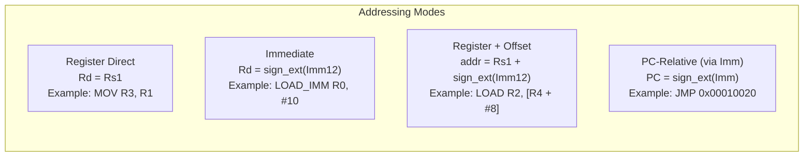
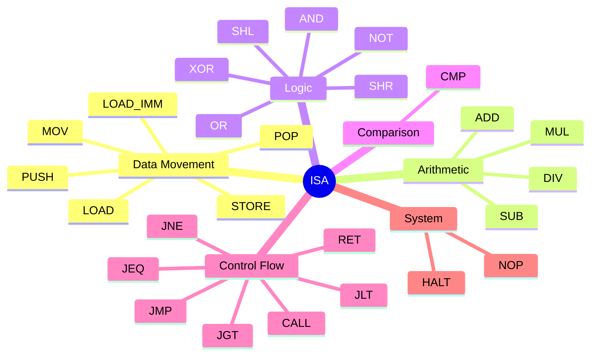

# Layer 01 — Instruction Set Architecture (ISA)

This document describes the complete ISA of the custom CPU simulator.  
The ISA is the contract between software (the assembler) and hardware (the simulator).

---

## 1. Instruction Encoding

Every instruction is exactly **32 bits wide** (fixed-width RISC encoding).

```
 31      24 23   20 19   16 15   12 11          0
 +----------+-------+-------+-------+-------------+
 |  opcode  |  Rd   |  Rs1  |  Rs2  |  Imm[11:0]  |
 +----------+-------+-------+-------+-------------+
    8 bits    4 bits  4 bits  4 bits    12 bits
```

| Field | Bits | Width | Description |
|-------|------|-------|-------------|
| `opcode` | [31:24] | 8 bits | Selects the operation |
| `Rd` | [23:20] | 4 bits | Destination register (0–15) |
| `Rs1` | [19:16] | 4 bits | Source register 1 (0–15) |
| `Rs2` | [15:12] | 4 bits | Source register 2 (0–15) |
| `Imm` | [11:0] | 12 bits | Immediate value, **sign-extended** to 32 bits |

The fixed width means every instruction fetch is exactly one aligned 32-bit
read — no variable-length decoding needed.

---

## 2. Encoding Worked Example

`ADD R3, R1, R2` — add R1 + R2, store in R3:

```
opcode = 0x04  → 0000 0100
Rd     = 3     → 0011
Rs1    = 1     → 0001
Rs2    = 2     → 0010
Imm    = 0     → 0000 0000 0000

Raw word (big-endian view):
  0000_0100  0011_0001  0010_0000  0000_0000
  = 0x04312000
```

Stored in memory as **little-endian** bytes: `00 20 31 04`

---

## 3. Register File

The CPU has **16 general-purpose 32-bit registers**: R0 through R15.


**Special register conventions:**

| Alias | Register | Role |
|-------|----------|------|
| `SP` | R13 | Stack pointer; `PUSH` decrements by 4 before write; `POP` increments after read |
| `LR` | R14 | Set by `CALL` to PC+4 (return address); read by `RET` |
| `PC` | R15 | Advanced by +4 after every fetch; set directly by jump/branch instructions |

---

## 4. Status Flags

Four 1-bit flags are stored in the `Flags` struct:

| Flag | Name | Set When |
|------|------|----------|
| `Z` | Zero | Result == 0 |
| `N` | Negative | Bit 31 of result is 1 |
| `C` | Carry | Unsigned overflow (ADD) or no borrow (SUB: a ≥ b) |
| `O` | Overflow | Signed overflow (result sign incorrect) |

Flags are updated by: `ADD`, `SUB`, `MUL`, `DIV`, `AND`, `OR`, `XOR`, `NOT`,
`SHL`, `SHR`, `CMP`.  
They are **not** modified by: `LOAD_IMM`, `LOAD`, `STORE`, `MOV`, all jumps,
`CALL`, `RET`, `PUSH`, `POP`, `NOP`, `HALT`.

---

## 5. Opcode Table

| Hex | Mnemonic | Operation | Flags Updated |
|-----|----------|-----------|---------------|
| `0x00` | `NOP` | No operation | — |
| `0x01` | `LOAD_IMM Rd, #Imm` | `Rd = sign_ext(Imm)` | — |
| `0x02` | `LOAD Rd, [Rs1+Imm]` | `Rd = MEM32[Rs1 + sign_ext(Imm)]` | — |
| `0x03` | `STORE [Rs1+Imm], Rs2` | `MEM32[Rs1 + sign_ext(Imm)] = Rs2` | — |
| `0x04` | `ADD Rd, Rs1, Rs2` | `Rd = Rs1 + Rs2` | Z, N, C, O |
| `0x05` | `SUB Rd, Rs1, Rs2` | `Rd = Rs1 - Rs2` | Z, N, C, O |
| `0x06` | `MUL Rd, Rs1, Rs2` | `Rd = Rs1 * Rs2` | Z, N |
| `0x07` | `DIV Rd, Rs1, Rs2` | `Rd = Rs1 / Rs2` | Z, N |
| `0x08` | `AND Rd, Rs1, Rs2` | `Rd = Rs1 & Rs2` | Z, N |
| `0x09` | `OR  Rd, Rs1, Rs2` | `Rd = Rs1 \| Rs2` | Z, N |
| `0x0A` | `XOR Rd, Rs1, Rs2` | `Rd = Rs1 ^ Rs2` | Z, N |
| `0x0B` | `NOT Rd, Rs1` | `Rd = ~Rs1` | Z, N |
| `0x0C` | `SHL Rd, Rs1, Rs2` | `Rd = Rs1 << Rs2` (logical) | Z, N, C |
| `0x0D` | `SHR Rd, Rs1, Rs2` | `Rd = Rs1 >> Rs2` (logical) | Z, N |
| `0x0E` | `MOV Rd, Rs1` | `Rd = Rs1` | — |
| `0x0F` | `CMP Rs1, Rs2` | flags = Rs1 - Rs2 (result discarded) | Z, N, C, O |
| `0x10` | `JMP Imm` | `PC = sign_ext(Imm)` (absolute) | — |
| `0x11` | `JEQ Imm` | `if Z: PC = sign_ext(Imm)` | — |
| `0x12` | `JNE Imm` | `if !Z: PC = sign_ext(Imm)` | — |
| `0x13` | `JGT Imm` | `if !Z && !N: PC = sign_ext(Imm)` | — |
| `0x14` | `JLT Imm` | `if N: PC = sign_ext(Imm)` | — |
| `0x15` | `CALL Imm` | `LR = PC+4; PC = sign_ext(Imm)` | — |
| `0x16` | `RET` | `PC = LR` | — |
| `0x17` | `PUSH Rs1` | `SP -= 4; MEM32[SP] = Rs1` | — |
| `0x18` | `POP Rd` | `Rd = MEM32[SP]; SP += 4` | — |
| `0xFF` | `HALT` | Stop execution | — |

---

## 6. Addressing Modes



| Mode | Used By | Range |
|------|---------|-------|
| Register direct | ALU ops, MOV | Any register pair |
| Signed 12-bit immediate | LOAD_IMM | −2048 … +2047 |
| Base + offset | LOAD, STORE | Rs1 ± 2047 bytes |
| Absolute immediate | JMP, JEQ, JNE, JGT, JLT, CALL | 0x000 … 0xFFF (12-bit) — assembler substitutes label address |

> **Imm12 limitation:** The 12-bit immediate can only hold values in −2048..2047.
> To load larger constants (e.g. the data base address `0x00080000`), programs
> use a two-step sequence: `LOAD_IMM Rd, #128` then `SHL Rd, Rd, R_shift` (as
> seen in `test_fibonacci.asm`).

---

## 7. Instruction Categories



---

## 8. Design Rationale

- **8-bit opcode field:** Allows up to 256 distinct opcodes — plenty of room
  for future extensions while keeping decoding trivial (a single `switch`).
- **4-register fields:** 4 bits → 16 registers; enough for most small programs
  without wasting encoding space.
- **12-bit signed immediate:** Covers small constants and struct field offsets
  common in embedded code.
- **Fixed-width 32-bit:** Every instruction is one word — no need to
  distinguish instruction boundaries.  The PC is always incremented by exactly
  4 bytes per cycle.
