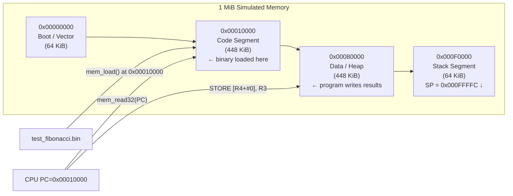
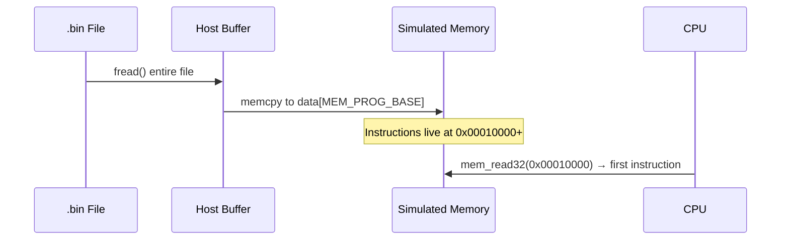

# Layer 02 — Memory Model

This document describes the simulated memory subsystem: how it is laid out,
how it is accessed, and why it was designed this way.

Source files: `src/memory.h`, `src/memory.c`

---

## 1. Overview

The CPU simulator uses a **flat 1 MiB (1,048,576 byte) byte-addressable memory**
backed by a single heap-allocated array.

```
Address range:  0x00000000 – 0x000FFFFF
Total size:     1,048,576 bytes (1 MiB)
Byte order:     Little-endian (32-bit words stored LSB first)
Access sizes:   8-bit (byte), 16-bit (halfword), 32-bit (word)
```

The choice of 1 MiB is intentional — it is large enough to hold real programs
and data, while being small enough that the entire live region fits in a modern
CPU's L2/L3 cache during simulation.

---

## 2. Address Space Map

```
0x000FFFFF ┌────────────────────────────────────┐
           │                                    │
           │   STACK SEGMENT                    │
           │   (grows downward ↓)               │
           │   Initial SP = 0x000FFFFC           │
           │                                    │
0x000F0000 ├────────────────────────────────────┤
           │                                    │
           │   DATA / HEAP SEGMENT              │
           │   Program-writable data            │
           │   Fibonacci results stored here    │
           │   Base: 0x00080000                 │
           │                                    │
0x00080000 ├────────────────────────────────────┤
           │                                    │
           │   CODE / PROGRAM SEGMENT           │
           │   Binary loaded here by main.c     │
           │   MEM_PROG_BASE = 0x00010000        │
           │   PC starts at 0x00010000          │
           │                                    │
0x00010000 ├────────────────────────────────────┤
           │                                    │
           │   BOOT / INTERRUPT VECTOR AREA     │
           │   Reserved for future use          │
           │                                    │
0x00000000 └────────────────────────────────────┘
```

---

## 3. Memory Layout Flow



---

## 4. Memory Struct

```c
typedef struct {
    uint8_t *data;   /* Pointer to the 1 MiB byte array (heap-allocated) */
    uint32_t size;   /* Always MEM_SIZE (1 MiB); kept for bounds checks   */
} Memory;
```

The `data` pointer is allocated once by `mem_init()` and freed by `mem_free()`.
All accesses go through accessor functions that bounds-check every access.

---

## 5. API — Lifecycle

| Function | Action |
|----------|--------|
| `mem_init(m)` | Allocate 1 MiB buffer, zero-initialise it |
| `mem_reset(m)` | Zero the buffer without re-allocating |
| `mem_free(m)` | Free the buffer |

---

## 6. API — Read / Write Accessors

| Function | Width | Description |
|----------|-------|-------------|
| `mem_read8(m, addr)` | 8-bit | Read one byte |
| `mem_read16(m, addr)` | 16-bit | Read two bytes (little-endian) |
| `mem_read32(m, addr)` | 32-bit | Read four bytes (little-endian) — used for instruction fetch |
| `mem_write8(m, addr, val)` | 8-bit | Write one byte |
| `mem_write16(m, addr, val)` | 16-bit | Write two bytes (little-endian) |
| `mem_write32(m, addr, val)` | 32-bit | Write four bytes (little-endian) — used by STORE and program loader |

All functions call `mem_bounds_check()` internally.  An out-of-bounds access
prints an error and terminates the simulator — there is no silent memory
corruption.

---

## 7. Endianness

All multi-byte values are stored **little-endian** (LSB at lowest address),
matching the ARM and x86 conventions of the target platforms.

**Example — writing `0xDEADBEEF` to address `0x00010000`:**

```
Address:  0x00010000  0x00010001  0x00010002  0x00010003
Contents:     0xEF        0xBE        0xAD        0xDE
              (LSB)                                (MSB)
```

Reading back with `mem_read32(m, 0x00010000)` reconstructs `0xDEADBEEF`.

---

## 8. Program Loading

`main.c` reads the `.bin` file into a temporary host buffer, then calls
`mem_write` to copy it into the simulated memory starting at `MEM_PROG_BASE`
(`0x00010000`).  The CPU's initial PC is then set to that address.



---

## 9. Stack Operation

The stack lives in the top 64 KiB (`0x000F0000 – 0x000FFFFF`).  
The Stack Pointer (`R13 / SP`) begins at `0x000FFFFC` (the highest aligned word).

```
Before PUSH R1:               After PUSH R1:
  SP = 0x000FFFFC               SP = 0x000FFFF8
                                MEM32[0x000FFFF8] = R1

Before POP R2:                After POP R2:
  SP = 0x000FFFF8               R2 = MEM32[0x000FFFF8]
  MEM32[0x000FFFF8] = val       SP = 0x000FFFFC
```

`PUSH` decrements SP by 4 **before** writing.  
`POP` reads then increments SP by 4 **after** reading.

---

## 10. Design Rationale

| Choice | Reason |
|--------|--------|
| Flat linear address space | Simplest possible model; avoids MMU/paging complexity not needed for a single-threaded simulator |
| Heap-allocated `uint8_t` array | One malloc, easily freed; `valgrind`-friendly |
| Bounds checking on every access | Catches bugs immediately at the faulting instruction instead of silently corrupting state |
| Little-endian | Matches ARM (BeagleBone Black target) and x86 host; avoids byte-swap cost |
| 1 MiB size | Large enough for programs + data + stack; small enough to fit in CPU cache for fast simulation |
