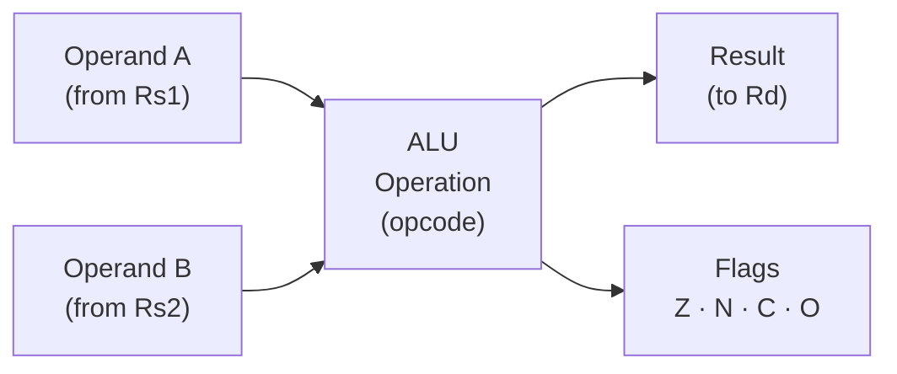
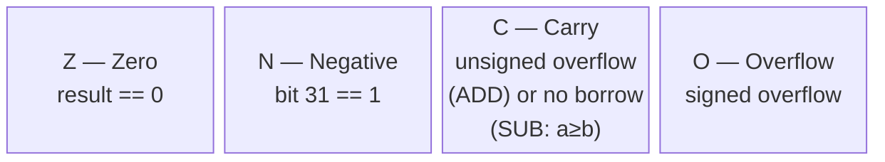
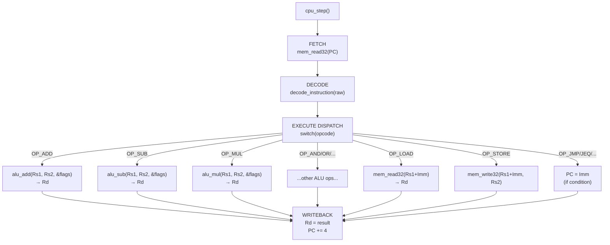

# Layer 03 — Arithmetic Logic Unit (ALU)

This document describes the ALU: what it computes, how flags are set, and
why it is implemented as pure functions separate from the CPU core.

Source files: `src/alu.h`, `src/alu.c`

---

## 1. Role of the ALU

The ALU is the compute engine of the CPU.  It takes two 32-bit input operands,
performs an operation, updates the status flags **in-place**, and returns a
32-bit result.



**Key design principle:** The ALU functions are **pure** — they do not touch
registers or memory.  They receive values, compute a result, write to the
`Flags` struct passed by pointer, and return.  All register reads and writes are
handled by the CPU core (`cpu.c`).

---

## 2. Status Flags



The `Flags` struct:
```c
typedef struct {
    uint8_t Z;   /* Zero flag     */
    uint8_t N;   /* Negative flag */
    uint8_t C;   /* Carry flag    */
    uint8_t O;   /* Overflow flag */
} Flags;
```

### Flag Update Matrix

| Operation | Z | N | C | O |
|-----------|---|---|---|---|
| ADD | ✓ | ✓ | ✓ | ✓ |
| SUB, CMP | ✓ | ✓ | ✓ | ✓ |
| MUL, DIV | ✓ | ✓ | cleared | cleared |
| AND, OR, XOR, NOT | ✓ | ✓ | cleared | cleared |
| SHL | ✓ | ✓ | ✓ | cleared |
| SHR | ✓ | ✓ | cleared | cleared |
| All others | — | — | — | — |

---

## 3. Operations Reference

### 3.1 ADD — `Rd = Rs1 + Rs2`

```
uint64_t wide   = (uint64_t)a + (uint64_t)b;
result          = (uint32_t)wide;

Z = (result == 0)
N = (result >> 31) & 1
C = (wide > 0xFFFFFFFF)           ← unsigned carry out
O = (~(a^b) & (a^result)) >> 31   ← signed overflow
```

The 64-bit intermediate `wide` is used to detect carry without overflow in
the host C type system.  Signed overflow is detected by checking whether two
operands of the same sign produced a result of a different sign.

### 3.2 SUB — `Rd = Rs1 - Rs2`

```
result = a - b;

Z = (result == 0)
N = (result >> 31) & 1
C = (a >= b)     ← C set when NO borrow (ARM convention)
O = ((a^b) & (a^result)) >> 31
```

`C = 1` when `a >= b` (unsigned) — this is the ARM "borrow invert" convention.
This makes it consistent with `CMP` followed by conditional branches.

### 3.3 MUL — `Rd = Rs1 * Rs2`

```
result = a * b;   (lower 32 bits only)
Z, N updated; C, O cleared.
```

Only the lower 32 bits are kept.  The upper 32 bits of a 64-bit product are
silently discarded (no overflow detection).

### 3.4 DIV — `Rd = Rs1 / Rs2`

```
if b == 0: print error, return 0   ← no exception; returns 0
result = a / b;   (unsigned integer division)
Z, N updated; C, O cleared.
```

Division by zero is a soft error: the simulator prints a warning and returns 0
rather than faulting, keeping the simulation running.

### 3.5 Bitwise: AND, OR, XOR, NOT

```
AND: result = a & b
OR:  result = a | b
XOR: result = a ^ b
NOT: result = ~a        (one-operand; Rs2 is unused)
All: Z, N updated; C, O cleared.
```

### 3.6 Shifts: SHL, SHR

```
SHL: result = a << (b & 0x1F)    ← logical left shift
     C = (b > 0) ? ((a >> (32 - b)) & 1) : 0   ← last bit shifted out
     Z, N updated; O cleared.

SHR: result = a >> (b & 0x1F)    ← logical right shift (unsigned)
     Z, N updated; C, O cleared.
```

Shift amount is masked to 5 bits (`& 0x1F`) to avoid undefined behaviour in C
for shifts ≥ 32.

---

## 4. Internal Helpers

Two private inline functions are shared across all operations:

```c
/* Set Z and N from a 32-bit result */
static inline void set_zn(uint32_t result, Flags *f) {
    f->Z = (result == 0) ? 1 : 0;
    f->N = ((result >> 31) & 1u) ? 1 : 0;
}

/* Clear C and O (for operations that don't produce carry/overflow) */
static inline void clear_co(Flags *f) {
    f->C = 0;
    f->O = 0;
}
```

Every ALU function either calls `set_zn` + sets C/O explicitly, or calls
`set_zn` + `clear_co`.

---

## 5. ALU in the Execute Stage



---

## 6. Flag Usage by Branch Instructions

After a `CMP Rs1, Rs2` (which internally calls `alu_sub`), branch instructions
test specific flag combinations:

| Mnemonic | Condition | Flag Expression |
|----------|-----------|-----------------|
| `JEQ` (equal) | `Rs1 == Rs2` | `Z == 1` |
| `JNE` (not equal) | `Rs1 != Rs2` | `Z == 0` |
| `JGT` (greater than, unsigned) | `Rs1 > Rs2` | `Z == 0 && N == 0` |
| `JLT` (less than, signed) | `Rs1 < Rs2` | `N == 1` |

---

## 7. Design Rationale

| Choice | Reason |
|--------|--------|
| Pure functions | Testable in isolation; no side effects beyond the Flags pointer |
| Flags pointer passed explicitly | Clear ownership; no global state |
| 64-bit intermediate for ADD | Correct carry detection without relying on compiler-specific overflow behaviour |
| ARM borrow-invert convention for SUB | Consistent with ARM ISA semantics; makes `CMP` + conditional branch natural |
| Division by zero returns 0 | Keeps the simulator running; a real CPU would raise a fault/trap |
