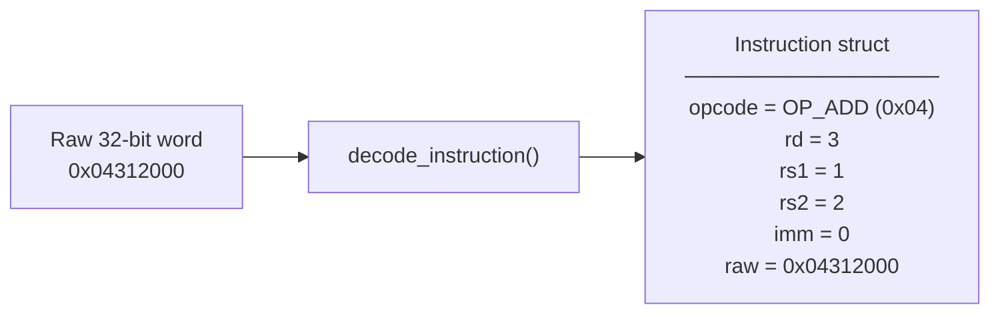
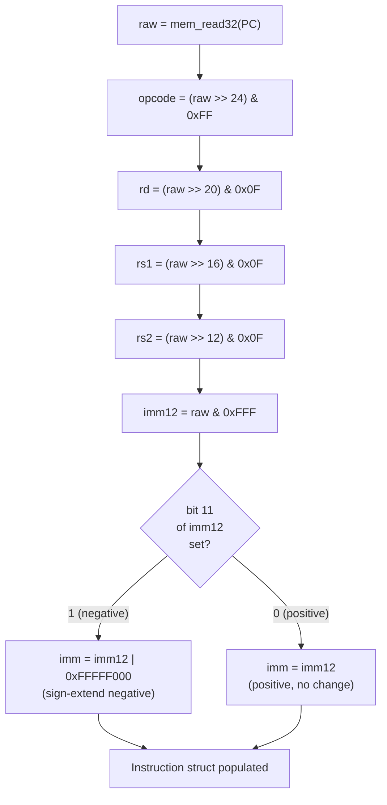

# Layer 04 — Instruction Decoder

This document describes how a raw 32-bit instruction word is decoded into a
typed `Instruction` struct, and how the disassembler produces human-readable
trace output.

Source files: `src/decoder.h`, `src/decoder.c`

---

## 1. Role of the Decoder

The decoder occupies **Stage 2** of the 4-stage cycle.  It takes a raw 32-bit
integer from memory and splits it into its named fields.



The `Instruction` struct is then passed to the execute stage, which dispatches
on `opcode`.

---

## 2. Instruction Struct

```c
typedef struct {
    Opcode   opcode;   /* 8-bit opcode extracted from [31:24]       */
    uint8_t  rd;       /* Destination register from [23:20]         */
    uint8_t  rs1;      /* Source register 1 from [19:16]            */
    uint8_t  rs2;      /* Source register 2 from [15:12]            */
    int32_t  imm;      /* Sign-extended 12-bit immediate from [11:0] */
    uint32_t raw;      /* Original word (kept for trace/debug)      */
} Instruction;
```

---

## 3. Bit Extraction

Each field is isolated by **masking** and **shifting** the raw word:

```
Raw word (32 bits):
  31      24 23   20 19   16 15   12 11          0
  +----------+-------+-------+-------+-------------+
  |  opcode  |  Rd   |  Rs1  |  Rs2  |  Imm[11:0]  |
  +----------+-------+-------+-------+-------------+
```

```c
opcode = (raw >> 24) & 0xFF;
rd     = (raw >> 20) & 0x0F;
rs1    = (raw >> 16) & 0x0F;
rs2    = (raw >> 12) & 0x0F;
imm12  = raw & 0xFFF;           /* unsigned 12-bit first */
```

---

## 4. Immediate Sign Extension

The raw immediate is 12 bits unsigned.  To make it usable as a signed 32-bit
value (for negative offsets and backward jumps), it is **sign-extended**:

```
imm12  = raw & 0xFFF;                  /* 0x000 – 0xFFF                   */
imm32  = (imm12 & 0x800)               /* is bit 11 (the sign bit) set?   */
           ? (int32_t)(imm12 | 0xFFFFF000u)  /* extend with 1s            */
           : (int32_t)imm12;                  /* already positive          */
```

**Example — encoding `#-4`:**

```
-4 in 12-bit two's complement = 0xFFC
raw[11:0] = 0xFFC
bit 11 = 1  → sign-extend: 0xFFFFFFC = -4 as int32_t  ✓
```

**Example — encoding `#10`:**

```
10 in 12-bit = 0x00A
bit 11 = 0  → keep: 0x0000000A = 10 as int32_t  ✓
```

---

## 5. Decoding Flow



---

## 6. Disassembler

The decoder module also includes `disasm_instruction()`, which converts a
decoded `Instruction` into a human-readable string for the trace output.

```c
void disasm_instruction(const Instruction *instr, char *buf, int buf_size);
```

Sample outputs:

| Instruction | Disassembly String |
|-------------|-------------------|
| `ADD R3, R1, R2` | `ADD  R3, R1, R2` |
| `LOAD_IMM R0, #10` | `LOAD_IMM R0, #10` |
| `STORE [R4+#0], R3` | `STORE  [R4+0], R3` |
| `JEQ 0x00010040` | `JEQ  0x00010040` |
| `HALT` | `HALT` |

The disassembler is called by `trace_print()` inside `cpu.c` when trace mode
is enabled (`--trace` flag).  Each cycle prints:

```
  [     1] 0x00010000: LOAD_IMM R1, #0               | Z=1 N=0 C=0 O=0
  [     2] 0x00010004: LOAD_IMM R2, #1               | Z=0 N=0 C=0 O=0
  [     3] 0x00010008: LOAD_IMM R0, #10              | Z=0 N=0 C=0 O=0
```

Format: `[cycle] address: disassembly | flags`

---

## 7. Trace Output Structure

```mermaid
sequenceDiagram
    participant cpu_step
    participant fetch as Fetch Stage
    participant decode as Decode Stage
    participant trace as trace_print()

    cpu_step->>fetch: fetch_addr = PC; raw = mem_read32(PC); PC += 4
    cpu_step->>decode: instr = decode_instruction(raw)
    cpu_step->>trace: if trace: disasm_instruction(&instr, buf)\n print cycle, addr, disasm, flags
    cpu_step->>cpu_step: execute(instr)
```

---

## 8. Design Rationale

| Choice | Reason |
|--------|--------|
| Decoder returns a struct by value | Simple; no allocation; the struct is small (5 fields) |
| `raw` field kept in struct | Allows disassembler to fall back to hex for unknown opcodes |
| Sign extension in decoder, not execute | Centralises the conversion in one place; all execute handlers receive a ready `int32_t imm` |
| Disassembler in same module | Decoder knows the encoding; disassembler is the inverse of encoding, so they belong together |
