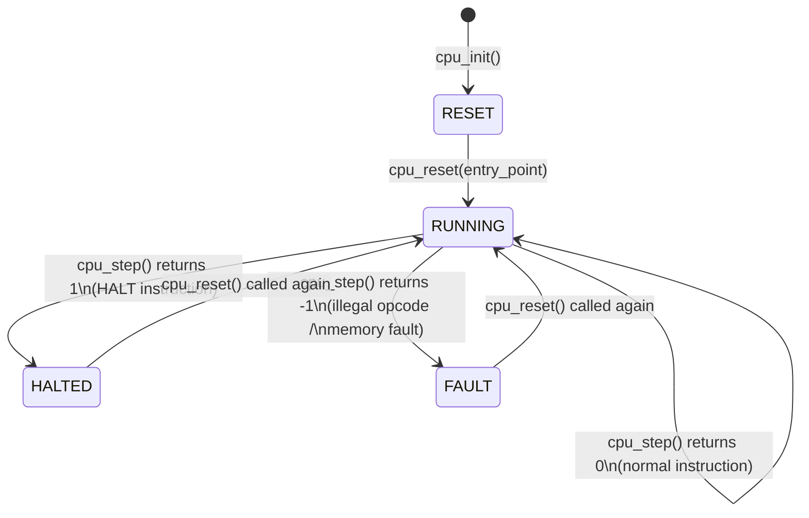
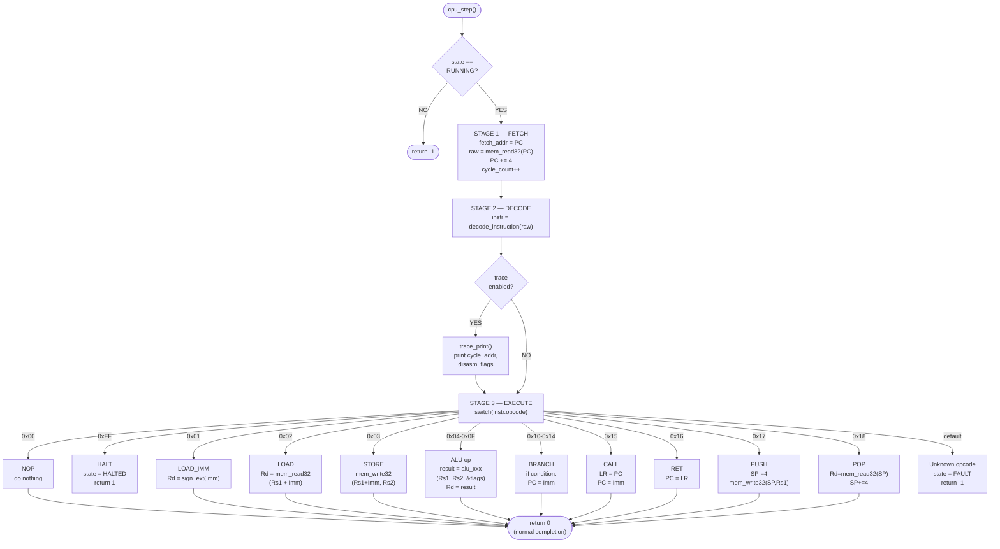
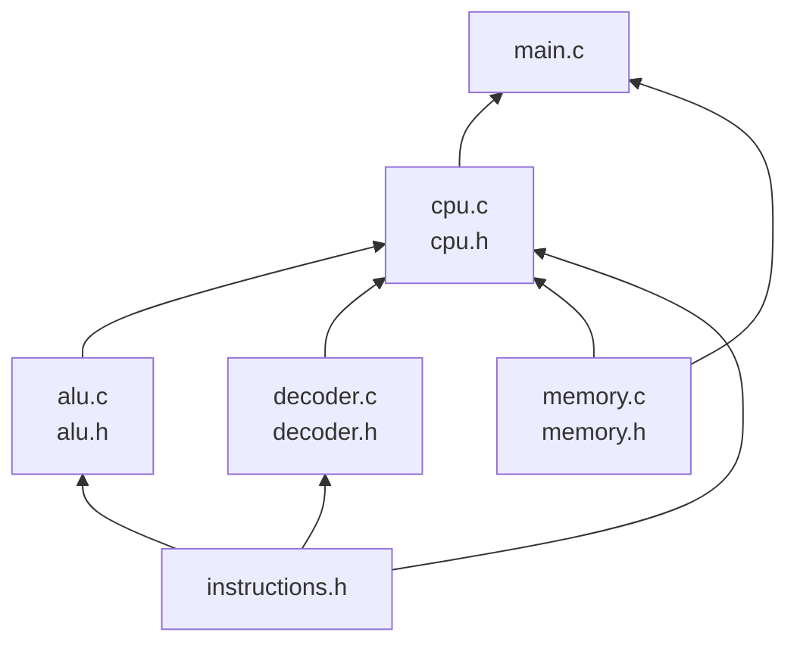

# Layer 05 — CPU Core

This document describes the CPU execution engine: the CPU struct, the state
machine, and the fetch → decode → execute → writeback cycle.

Source files: `src/cpu.h`, `src/cpu.c`

---

## 1. The CPU Struct

```c
typedef struct {
    uint32_t  regs[NUM_REGS];  /* R0–R15: 16 × 32-bit registers         */
    Flags     flags;           /* Z, N, C, O status flags                */
    Memory   *mem;             /* Pointer to the simulated memory        */
    CpuState  state;           /* RESET / RUNNING / HALTED / FAULT       */
    uint64_t  cycle_count;     /* Total fetch-decode-execute cycles done */
    uint32_t  entry_point;     /* PC value saved from last cpu_reset()   */
    int       trace;           /* Non-zero → print trace each cycle      */
} CPU;
```

The `CPU` struct is the **single source of truth** for all mutable simulator
state.  Every component that needs registers, flags, or memory goes through
this struct.

---

## 2. CPU State Machine



| State | Value | Meaning |
|-------|-------|---------|
| `CPU_STATE_RESET` | 0 | Not yet initialised or held in reset |
| `CPU_STATE_RUNNING` | 1 | Actively executing instructions |
| `CPU_STATE_HALTED` | 2 | `HALT` instruction reached |
| `CPU_STATE_FAULT` | 3 | Unrecoverable error (illegal opcode, out-of-bounds) |

---

## 3. Lifecycle Functions

### `cpu_init(CPU *cpu, Memory *mem)`

- Zero-initialises all registers and flags.
- Attaches the `Memory` pointer.
- Sets state to `CPU_STATE_RESET`.
- Does **not** touch memory contents.

### `cpu_reset(CPU *cpu, uint32_t entry_point)`

- Zeros all registers and flags.
- Zeros `cycle_count`.
- Sets `PC = entry_point`.
- Sets `SP = MEM_STACK_TOP` (0x000FFFFC).
- Sets state to `CPU_STATE_RUNNING`.

---

## 4. The Fetch → Decode → Execute → Writeback Cycle

The core of the simulator is `cpu_step()`, which models **one clock cycle**.



---

## 5. `cpu_run()` — Full Program Execution

`cpu_run()` calls `cpu_step()` in a loop until the CPU halts or faults.

```c
int cpu_run(CPU *cpu, uint64_t max_cycles) {
    while (cpu->state == CPU_STATE_RUNNING) {
        if (max_cycles > 0 && cpu->cycle_count >= max_cycles)
            return -2;           /* timeout */
        int r = cpu_step(cpu);
        if (r == 1)  return 0;   /* HALT */
        if (r == -1) return -1;  /* FAULT */
    }
    return (cpu->state == CPU_STATE_HALTED) ? 0 : -1;
}
```

Return codes:

| Value | Meaning |
|-------|---------|
| `0` | HALT reached normally |
| `-1` | FAULT encountered |
| `-2` | `max_cycles` exceeded (if set) |

---

## 6. PC Management

The Program Counter (`R15 / PC`) is managed as follows:

```
┌────────────────────────────────────────────────────────┐
│  FETCH stage:                                          │
│    fetch_addr = PC        ← save address for trace     │
│    raw        = mem_read32(PC)                         │
│    PC        += 4         ← pre-increment              │
│                                                        │
│  EXECUTE stage (branches):                             │
│    JMP:  PC = imm         ← absolute override          │
│    JEQ:  if Z:  PC = imm                               │
│    JNE:  if !Z: PC = imm                               │
│    JGT:  if !Z && !N: PC = imm                         │
│    JLT:  if N:  PC = imm                               │
│    CALL: LR = PC; PC = imm   (PC already +4 here)     │
│    RET:  PC = LR                                       │
└────────────────────────────────────────────────────────┘
```

PC is incremented **before** execute, so when `CALL` saves `LR = PC`, it
correctly saves the address of the instruction **after** the call.

---

## 7. Convenience Macros

Inside `cpu.c`, register aliases make the execute code readable:

```c
#define PC      (cpu->regs[REG_PC])   /* cpu->regs[15] */
#define SP      (cpu->regs[REG_SP])   /* cpu->regs[13] */
#define LR      (cpu->regs[REG_LR])   /* cpu->regs[14] */
#define REG(n)  (cpu->regs[(n) & 0x0F])
```

`REG(n)` masks the register index to 4 bits, ensuring safety even if a decoded
register field is somehow malformed.

---

## 8. CPU Affinity Pinning

In `main.c`, before execution starts, the process is pinned to **CPU core 0**
using `sched_setaffinity()`:

```c
cpu_set_t mask;
CPU_ZERO(&mask);
CPU_SET(0, &mask);
sched_setaffinity(0, sizeof(mask), &mask);
```

This ensures the simulation:
- Runs on exactly one physical core
- Has no OS-driven migration to other cores mid-execution
- Models accurately what "single-threaded" means at the hardware level

This is especially meaningful when the ARM binary runs on a BeagleBone Black
(multi-core capable chip), guaranteeing it stays on core 0.

---

## 9. CPU Subsystem Dependencies



`cpu.c` is the integration point — it imports and orchestrates all other
subsystems.  `main.c` owns lifecycle (init, reset, run) and I/O (file loading,
output formatting).

---

## 10. Design Rationale

| Choice | Reason |
|--------|--------|
| No pipeline | Simplest correct model; one instruction completes entirely before the next begins |
| PC pre-incremented in fetch | `CALL` automatically saves the correct return address (PC+4) |
| State enum | Clean handling of RESET / RUNNING / HALTED / FAULT rather than ad-hoc flags |
| `cycle_count` as `uint64_t` | Can count 2⁶⁴ ≈ 1.8 × 10¹⁹ cycles without overflow |
| `trace` flag in struct | Avoids a global variable; the same CPU can run with or without tracing |
