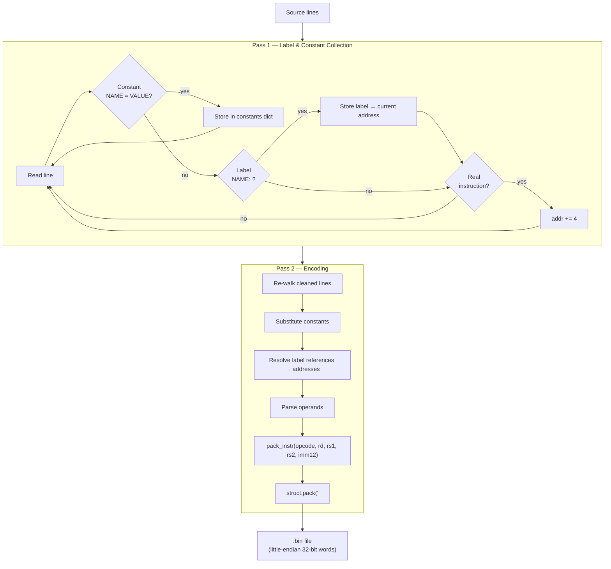

# Layer 06 — Assembler

This document describes the Python assembler that converts `.asm` text files
into loadable `.bin` binary files.

Source file: `tools/assembler.py`

---

## 1. Role

The assembler bridges human-readable assembly source and the binary that the
CPU simulator loads at `MEM_PROG_BASE` (`0x00010000`).


---

## 2. Two-Pass Architecture

The assembler uses the classic **two-pass** design.



**Why two passes?**  
A forward jump like `JGT LOOP` appears before the `LOOP:` label is defined.
Pass 1 calculates all label addresses without emitting code; Pass 2 can then
resolve every label reference to a concrete address.

---

## 3. Source Syntax

### Comments

```asm
; This is a full-line comment
# This is also a full-line comment
ADD R3, R1, R2      ; inline comment (after semicolon)
```

`#` is only a comment marker at the start of a line.  Inside an operand,
`#N` means an immediate value (`LOAD_IMM R0, #10`).

### Labels

```asm
LOOP:
    ADD R3, R1, R2
```

Labels resolve to the **absolute address** of the **next instruction** that
follows them.  They are stored in uppercase internally.

### Constants

```asm
STRIDE = 4
LOAD_IMM R5, #STRIDE    ; equivalent to LOAD_IMM R5, #4
```

### Instructions

```
MNEMONIC  OPERANDS    ; comment
```

---

## 4. Operand Formats

| Format | Example | Parsed As |
|--------|---------|-----------|
| Register | `R3` | Register index 3 |
| Immediate (decimal) | `#10` or `10` | Integer 10 |
| Immediate (hex) | `#0xFF` | Integer 255 |
| Immediate (binary) | `#0b1010` | Integer 10 |
| Memory reference | `[R4 + #8]` | Base = R4, offset = 8 |
| Memory reference | `[R4 - #4]` | Base = R4, offset = −4 |
| Memory (no offset) | `[R4]` | Base = R4, offset = 0 |
| Label reference | `LOOP` | Resolved to absolute address |

---

## 5. Instruction Word Packing

All operand parsing feeds into `pack_instr()`:

```python
def pack_instr(opcode, rd=0, rs1=0, rs2=0, imm12=0) -> int:
    return (
        ((opcode & 0xFF) << 24) |
        ((rd     & 0x0F) << 20) |
        ((rs1    & 0x0F) << 16) |
        ((rs2    & 0x0F) << 12) |
        (imm12  & 0x0FFF)
    )
```

The resulting 32-bit integer is written to the binary file as a **little-endian
unsigned 32-bit word** using `struct.pack('<I', word)`.

---

## 6. Immediate Range Validation

`encode_imm12()` validates that the immediate fits in a signed 12-bit value:

```python
if val < -2048 or val > 2047:
    raise ValueError(f"Line {lineno}: immediate {val} does not fit in [-2048..2047]")
return val & 0xFFF   # two's complement encoding
```

When a label address is used as a jump target, the **absolute** address
(e.g. `0x00010028`) is jammed into the 12-bit field.  This is a deliberate
limitation: only the lowest 12 bits of the address are encoded.  The assembler
warns when the full address is truncated.

---

## 7. Addressing the Imm12 Limitation — the Shift Trick

Loading values larger than 2047 requires a two-step sequence.

**Problem:** load the data base address `0x00080000` into a register.

`0x00080000 = 128 × 2¹²`

```asm
LOAD_IMM  R4, #128     ; R4 = 128 (fits in 12 bits ✓)
LOAD_IMM  R7, #12      ; R7 = 12  (shift amount)
SHL       R4, R4, R7   ; R4 = 128 << 12 = 0x00080000  ✓
```

This pattern appears in `test_fibonacci.asm` and is a common idiom when the
immediate field is too narrow for a full 32-bit constant.

---

## 8. Output Format

The output `.bin` file is a raw sequence of 32-bit **little-endian** words.
There is no header, no ELF/DWARF wrapper — just instruction words.

```
Byte offset 0x00:  word[0]   = first instruction  (little-endian)
Byte offset 0x04:  word[1]   = second instruction
...
```

`main.c` loads this at `MEM_PROG_BASE` (0x00010000) with a direct `memcpy`
into the simulated memory buffer.

---

## 9. Usage

```bash
# Assemble a program
python3 tools/assembler.py programs/test_fibonacci.asm programs/test_fibonacci.bin

# Via Makefile
make assemble
```

---

## 10. Design Rationale

| Choice | Reason |
|--------|--------|
| Python | Rapid prototyping; excellent string/regex support; no build step |
| Two-pass | Handles forward label references correctly |
| Absolute addresses for labels | Simplest jump model; labels become immediate values in JMP/CALL fields |
| No ELF output | The simulator has a trivial loader; a binary blob is sufficient |
| `struct.pack('<I')` | Guarantees little-endian output regardless of host byte order |
