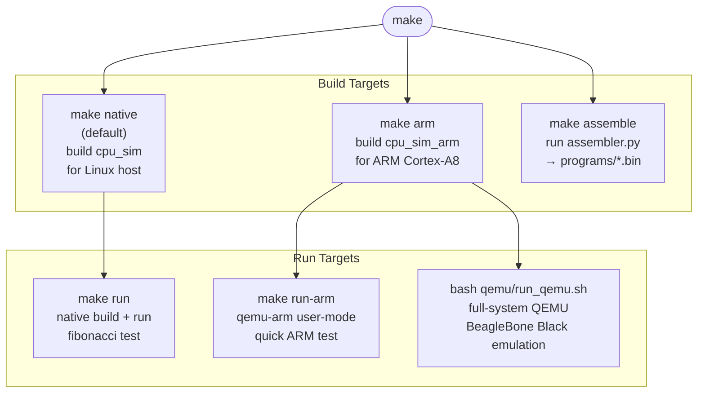
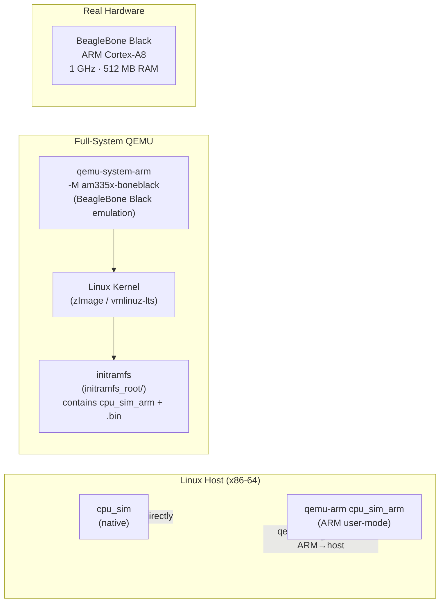
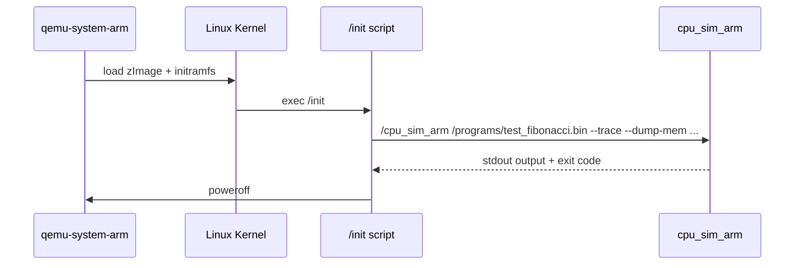
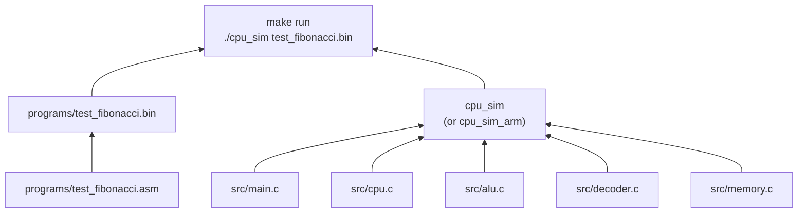

# Layer 07 — Toolchain & Build System

This document describes how the project is compiled, assembled, and run —
both natively on a Linux host and cross-compiled for ARM hardware.

Source files: `Makefile`, `qemu/README_QEMU.md`, `qemu/run_qemu.sh`

---

## 1. Build Targets at a Glance



---

## 2. Native Build — Linux Host

```bash
# Build the native simulator binary
make native         # produces: Implementation/cpu_sim

# Run the Fibonacci test with trace and memory dump
make run
# Equivalent to:
./cpu_sim programs/test_fibonacci.bin --trace --dump-mem 0x00080000 40
```

**Compiler flags:**

| Flag | Purpose |
|------|---------|
| `-std=c11` | C11 standard |
| `-Wall -Wextra -Wpedantic -Wshadow` | Treat nearly all warnings as errors |
| `-O2` | Optimise for speed |
| `-D_GNU_SOURCE` | Enable `sched_setaffinity()` and other GNU extensions |

---

## 3. ARM Cross-Compilation

```bash
# Cross-compile for ARM Cortex-A8 (BeagleBone Black)
make arm            # produces: Implementation/cpu_sim_arm

# Test immediately on the host with qemu-arm user-mode
make run-arm
```

**Cross-compiler:** `arm-linux-gnueabihf-gcc`  
(Falls back to `/tmp/arm-gnu-toolchain/bin/arm-none-linux-gnueabihf-gcc`)

**Additional ARM flags:**

| Flag | Purpose |
|------|---------|
| `-march=armv7-a` | Target ARMv7-A ISA (Cortex-A8) |
| `-mtune=cortex-a8` | Tune instruction scheduling for A8 |
| `-mfpu=neon` | Enable NEON SIMD (unused by sim, but correct for BBB) |
| `-mfloat-abi=hard` | Use hardware floating-point ABI |
| `-static` | Fully static binary — no shared library dependencies |

The `-static` flag produces a self-contained binary that runs on a minimal
rootfs (the QEMU initramfs contains no shared libs).

---

## 4. Source Files Compiled

```
src/main.c      — Entry point, argument parsing, file loader
src/cpu.c       — Fetch-decode-execute engine
src/alu.c       — All arithmetic and logic operations
src/decoder.c   — 32-bit word → Instruction struct
src/memory.c    — 1 MiB simulated memory
```

All headers (`*.h`) are in the same `src/` directory; the `-Isrc` flag
includes them.

---

## 5. Assembler Step

```bash
make assemble
# Runs:
python3 tools/assembler.py programs/test_fibonacci.asm programs/test_fibonacci.bin
```

The `.bin` file is a prerequisite of `make run` — if the source changes,
`make` will automatically re-assemble before running.

---

## 6. Execution Modes



### Mode 1: Native (`./cpu_sim`)

The simulator runs as a native Linux process.  `sched_setaffinity(0, core0)`
pins it to core 0.  Fastest mode for development.

### Mode 2: qemu-arm (user-mode)

`qemu-arm cpu_sim_arm` translates each ARM instruction to the host ISA at
runtime.  Functions as a quick validation that the ARM binary is correct
without needing a full OS image.

### Mode 3: qemu-system-arm (full-system)

A complete ARM SoC is emulated including:
- ARM Cortex-A9 core (Versatile Express board, `-M vexpress-a9`)
- Device Tree Blob (`.dtb`)
- Linux kernel image
- Custom `initramfs` containing `cpu_sim_arm` and the `.bin` program

Boot sequence:



### Mode 4: Real BeagleBone Black

Copy `cpu_sim_arm` and `test_fibonacci.bin` to the board, then:

```bash
chmod +x cpu_sim_arm
./cpu_sim_arm programs/test_fibonacci.bin --trace --dump-mem 0x00080000 40
```

---

## 7. Makefile `clean`

```bash
make clean
# Removes: cpu_sim  cpu_sim_arm  programs/*.bin
```

---

## 8. Build Dependency Graph



---

## 9. `--trace` and `--dump-mem` Flags

| Flag | Effect |
|------|--------|
| `--trace` | Print `[cycle] addr: disasm \| flags` each instruction |
| `--max-cycles N` | Abort after N cycles (safety net for infinite loops) |
| `--dump-mem ADDR LEN` | After HALT, hex-dump LEN bytes starting at ADDR |

**Typical Fibonacci invocation:**

```bash
./cpu_sim programs/test_fibonacci.bin \
    --trace \
    --dump-mem 0x00080000 40
```

The `--dump-mem 0x00080000 40` argument dumps the 40 bytes (10 × 4-byte words)
of Fibonacci results written to the data segment.
