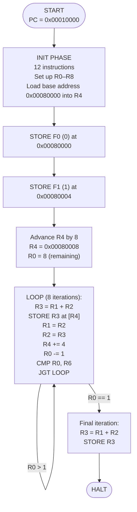
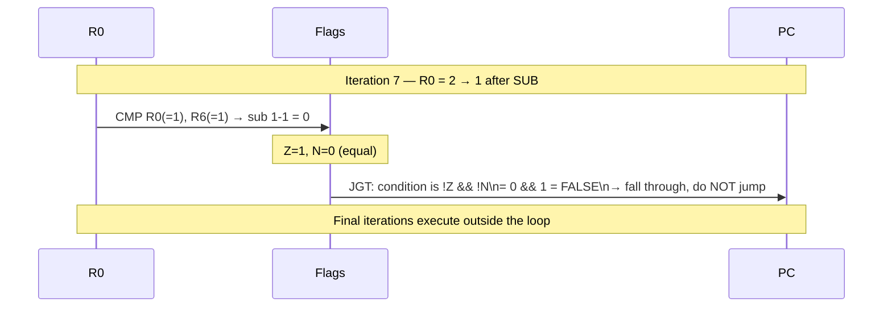
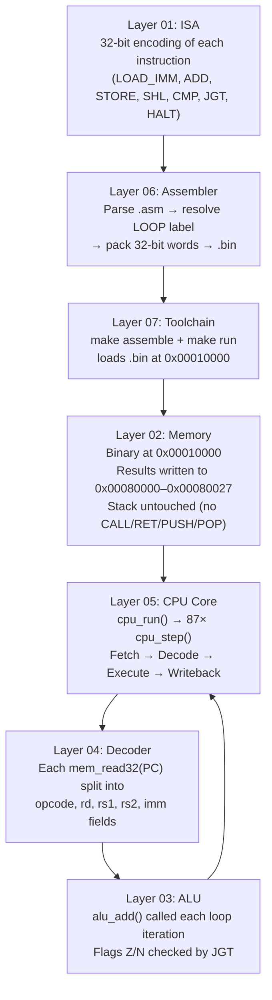

# Layer 08 — Fibonacci End-to-End Walkthrough

This document traces the complete execution of `test_fibonacci.asm` through
every layer of the simulator — from source text to memory contents.

---

## 1. What the Program Does

Computes the first **10 Fibonacci numbers** (F0 through F9) and writes them
into the data segment starting at address `0x00080000`.

```
F0 = 0     stored at 0x00080000
F1 = 1     stored at 0x00080004
F2 = 1     stored at 0x00080008
F3 = 2     stored at 0x0008000C
F4 = 3     stored at 0x00080010
F5 = 5     stored at 0x00080014
F6 = 8     stored at 0x00080018
F7 = 13    stored at 0x0008001C
F8 = 21    stored at 0x00080020
F9 = 34    stored at 0x00080024
```

---

## 2. Full Program Flow



---

## 3. Initialization Phase — Step by Step

| Cycle | PC | Instruction | Register Effect |
|-------|----|-------------|-----------------|
| 1 | 0x00010000 | `LOAD_IMM R1, #0` | R1 = 0 (F0) |
| 2 | 0x00010004 | `LOAD_IMM R2, #1` | R2 = 1 (F1) |
| 3 | 0x00010008 | `LOAD_IMM R0, #10` | R0 = 10 (loop counter) |
| 4 | 0x0001000C | `LOAD_IMM R5, #4` | R5 = 4 (byte stride) |
| 5 | 0x00010010 | `LOAD_IMM R6, #1` | R6 = 1 (decrement) |
| 6 | 0x00010014 | `LOAD_IMM R4, #0` | R4 = 0 (placeholder) |
| 7 | 0x00010018 | `LOAD_IMM R4, #128` | R4 = 128 = 0x80 |
| 8 | 0x0001001C | `LOAD_IMM R7, #12` | R7 = 12 (shift amount) |
| 9 | 0x00010020 | `SHL R4, R4, R7` | R4 = 128 << 12 = **0x00080000** |
| 10 | 0x00010024 | `STORE [R4+#0], R1` | MEM[0x00080000] = 0 ← F0 |
| 11 | 0x00010028 | `STORE [R4+#4], R2` | MEM[0x00080004] = 1 ← F1 |
| 12 | 0x0001002C | `LOAD_IMM R8, #8` | R8 = 8 |
| 13 | 0x00010030 | `ADD R4, R4, R8` | R4 = 0x00080000 + 8 = **0x00080008** |
| 14 | 0x00010034 | `LOAD_IMM R0, #8` | R0 = 8 (8 remaining iterations) |

**Register file after init:**

```
R0 =  8          (remaining loop count)
R1 =  0          (fib(n-2) = F0)
R2 =  1          (fib(n-1) = F1)
R3 =  0          (unused yet)
R4 =  0x00080008 (write pointer, past the 2 pre-stored values)
R5 =  4          (stride)
R6 =  1          (decrement)
R7 =  12         (shift amount, no longer needed)
R8 =  8          (offset added to R4)
PC =  0x00010038 (first instruction of LOOP)
SP =  0x000FFFFC (untouched)
Flags: Z=0 N=0 C=0 O=0
```

---

## 4. Loop Iteration Trace

Each iteration executes 8 instructions.  The loop body (starting at `LOOP:`):

| Instruction | Effect |
|-------------|--------|
| `ADD R3, R1, R2` | R3 = R1 + R2 (compute next Fibonacci) |
| `STORE [R4+#0], R3` | Write R3 to current memory slot |
| `MOV R1, R2` | Slide: R1 ← R2 |
| `MOV R2, R3` | Slide: R2 ← R3 |
| `ADD R4, R4, R5` | Advance pointer by 4 bytes |
| `SUB R0, R0, R6` | Decrement counter |
| `CMP R0, R6` | Compare counter with 1 |
| `JGT LOOP` | Jump if counter > 1 |

**Iteration-by-iteration register state:**

| Iter | R1 (in) | R2 (in) | R3 = R1+R2 | R4 → addr written | R0 after |
|------|---------|---------|------------|-------------------|----------|
| 1 | 0 | 1 | **1** (F2) | 0x00080008 | 7 |
| 2 | 1 | 1 | **2** (F3) | 0x0008000C | 6 |
| 3 | 1 | 2 | **3** (F4) | 0x00080010 | 5 |
| 4 | 2 | 3 | **5** (F5) | 0x00080014 | 4 |
| 5 | 3 | 5 | **8** (F6) | 0x00080018 | 3 |
| 6 | 5 | 8 | **13** (F7) | 0x0008001C | 2 |
| 7 | 8 | 13 | **21** (F8) | 0x00080020 | 1 |
| → JGT falls through (R0=1, not > 1) | | | | | |
| final | 13 | 21 | **34** (F9) | 0x00080024 | — |

---

## 5. Flag State During CMP + JGT



---

## 6. Memory State After HALT

```
Address      Hex bytes (little-endian)    Decimal   Fibonacci
0x00080000:  00 00 00 00                   0         F0
0x00080004:  01 00 00 00                   1         F1
0x00080008:  01 00 00 00                   1         F2
0x0008000C:  02 00 00 00                   2         F3
0x00080010:  03 00 00 00                   3         F4
0x00080014:  05 00 00 00                   5         F5
0x00080018:  08 00 00 00                   8         F6
0x0008001C:  0D 00 00 00                  13         F7
0x00080020:  15 00 00 00                  21         F8
0x00080024:  22 00 00 00                  34         F9
```

This is exactly what appears in the `--dump-mem 0x00080000 40` output.

---

## 7. Execution Statistics

| Stat | Value |
|------|-------|
| Total instructions | ~87 cycles |
| Init phase | 14 cycles |
| Loop body × 7 iterations | 56 cycles |
| Final 2 instructions | 2 cycles |
| HALT | 1 cycle |
| STORE instructions | 10 (one per Fibonacci number) |
| Memory written | 40 bytes (10 × 4-byte words) |

---

## 8. End-to-End Layer Map



---

## 9. Verifying the Output

Run the simulator and check the dump:

```bash
./cpu_sim programs/test_fibonacci.bin --dump-mem 0x00080000 40
```

Expected last lines:

```
Memory dump at 0x00080000 (40 bytes):
  0x00080000:  00 00 00 00  01 00 00 00  01 00 00 00  02 00 00 00
  0x00080010:  03 00 00 00  05 00 00 00  08 00 00 00  0d 00 00 00
  0x00080020:  15 00 00 00  22 00 00 00
```

Reading each 4-byte little-endian word: `0, 1, 1, 2, 3, 5, 8, 13, 21, 34` — the first 10 Fibonacci numbers.
