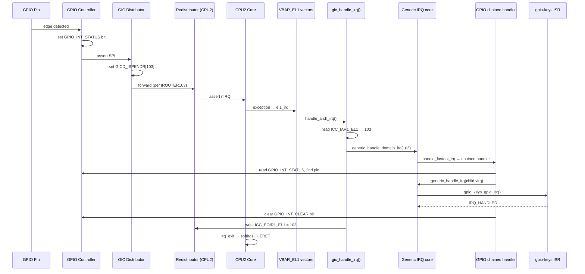

# End-to-End ARM64 Interrupt Flow: GPIO Example (GICv3 + Linux Kernel)

A kernel-engineer-level walkthrough of what happens from the moment a GPIO line
toggles, all the way to the device driver's IRQ handler running on a specific
CPU in Linux on ARM64. We use **GICv3** (most common on modern ARM64 SoCs) and
a **GPIO button press** as the example.

---

## 1. The Cast of Characters

| Layer | Component | Role |
|---|---|---|
| HW | GPIO controller (e.g., pl061, Tegra GPIO, Qualcomm TLMM) | Detects pin edge/level, latches IRQ status |
| HW | **GIC-500/600** = GICv3 | Arbitrates, prioritizes, routes IRQs to a target CPU |
| HW | CPU core (Cortex-A) | Takes the exception, jumps to `VBAR_EL1` vector |
| SW | Linux `irqchip` driver for GIC (`drivers/irqchip/irq-gic-v3.c`) | Talks to GIC registers |
| SW | Linux `irqchip` driver for GPIO (`drivers/gpio/gpio-*.c`) | Cascaded irqchip; demuxes GPIO IRQs |
| SW | Generic IRQ / `irqdomain` / `irq_desc` core | Maps HW IRQ → Linux virtual IRQ → handler |
| SW | Device driver (e.g., `gpio-keys`) | The actual `request_irq()` consumer |

GICv3 has **three logical pieces**:

- **Distributor (GICD)** — global, one per SoC. MMIO at e.g. `0x08000000`.
- **Redistributor (GICR)** — per-CPU, MMIO frames.
- **CPU Interface (ICC_* sysregs)** — *system registers* inside each core
  (not MMIO in GICv3!).

Interrupt ID ranges:

- **SGI** 0–15 (software-generated, inter-processor)
- **PPI** 16–31 (per-CPU private, e.g., arch timer = 30)
- **SPI** 32–1019 (shared peripheral, GPIO controllers live here)
- **LPI** 8192+ (message-based, via ITS, used for PCIe MSI)

Our GPIO IRQ is an **SPI**, say **SPI #71** → GIC INTID = `32 + 71 = 103`.

---

## 2. Hardware: Pin Toggle → GIC Pending

### Step 2.1 — GPIO controller latches the event

1. User presses button → pin voltage drops.
2. GPIO controller's edge-detect logic sets a bit in its `GPIO_INT_STATUS`
   register (name varies by SoC: `GPIORIS`, `INT_STA`, etc.).
3. If that pin is unmasked in `GPIO_INT_MASK`/`GPIO_INT_ENABLE`, the controller
   asserts its **single output line** going to the GIC. This line is wired to a
   specific SPI number defined in the SoC TRM (e.g., SPI 71).

> Key point: many GPIO pins (often 32) **share one SPI line** into the GIC.
> That's why GPIO drivers register as a **cascaded/chained irqchip** — the
> kernel must demux which pin fired.

### Step 2.2 — GIC Distributor receives the SPI

The signal arrives at the **GICD**. The relevant per-INTID registers:

| Register | Purpose |
|---|---|
| `GICD_ISENABLERn` | Enable bit for the INTID (set during `request_irq()`) |
| `GICD_IPRIORITYRn` | 8-bit priority |
| `GICD_ICFGRn` | Edge vs level configuration |
| `GICD_IROUTERn` (GICv3) | Target CPU affinity (Aff3.Aff2.Aff1.Aff0) or "1-of-N" |
| `GICD_ISPENDRn` | Set when IRQ becomes pending |
| `GICD_ISACTIVERn` | Set when CPU acknowledges |

Sequence inside the GIC:

1. Distributor sees the SPI assertion, checks `GICD_ISENABLER` — enabled? yes.
2. Sets the pending bit in `GICD_ISPENDR`.
3. Looks up `GICD_IROUTER103` → e.g., `0x0.0.0.2` meaning Aff0=2 → CPU2.
   (Or "1-of-N" mode: pick any online CPU with the IRQ unmasked.)
4. Forwards the pending IRQ to **CPU2's Redistributor (GICR)**.

### Step 2.3 — Redistributor → CPU Interface

- The GICR holds per-CPU state for SGIs/PPIs and acts as the conduit for SPIs
  targeted at this core.
- The GICR signals the CPU's **physical IRQ pin (nIRQ)** if the pending IRQ's
  priority is higher than the running priority (`ICC_RPR_EL1`) and the priority
  mask (`ICC_PMR_EL1`).
- The CPU's `ICC_IAR1_EL1` register will, on read, return INTID 103.

---

## 3. CPU Exception Entry (ARM64)

When `nIRQ` asserts and `PSTATE.I == 0`:

1. CPU takes an **IRQ exception to EL1** (Linux runs the kernel at EL1,
   userspace at EL0).
2. Hardware updates:
   - `ELR_EL1` ← return PC
   - `SPSR_EL1` ← saved PSTATE
   - `PSTATE.I = 1` (mask further IRQs)
   - PC ← `VBAR_EL1 + offset`
3. The offset depends on what was running:
   - From EL0 (userspace): offset `0x480`
   - From EL1 (kernel): offset `0x280`

### Step 3.1 — Vector table

Linux's vector table is in `arch/arm64/kernel/entry.S` (`vectors` symbol
installed into `VBAR_EL1` at boot). The IRQ vector branches to `el1_irq` or
`el0_irq`.

### Step 3.2 — `el1_irq` / `el0_irq`

Roughly:

```
kernel_entry 1            // save x0..x30, sp, etc. onto pt_regs
irq_handler               // → calls handle_arch_irq
kernel_exit 1
```

- `handle_arch_irq` is a function pointer set during GIC probe via
  `set_handle_irq()`. For GICv3 it points to **`gic_handle_irq()`** in
  `drivers/irqchip/irq-gic-v3.c`.
- Before calling it, the kernel calls `irq_enter()` (updates preempt count,
  RCU, accounting), switches to the **IRQ stack** (`irq_stack_entry`).

---

## 4. `gic_handle_irq()` — Reading the GIC

This is the heart of the SW/HW handoff:

```c
do {
    irqnr = read_sysreg_s(SYS_ICC_IAR1_EL1);   // ACK: get INTID = 103
    if (irqnr == ICC_IAR1_EL1_SPURIOUS) break;

    if (irqnr >= 16 && irqnr < 1020) {
        // SPI/PPI path
        generic_handle_domain_irq(gic_data.domain, irqnr);
        write_sysreg_s(irqnr, SYS_ICC_EOIR1_EL1);  // EOI
        continue;
    }
    if (irqnr < 16) {
        // SGI / IPI
        handle_IPI(irqnr, regs);
        write_sysreg_s(irqnr, SYS_ICC_EOIR1_EL1);
    }
} while (true);
```

What the registers do:

- **`ICC_IAR1_EL1` (Interrupt Acknowledge Register, Group 1)** — reading it
  returns the highest-priority pending INTID **and** moves it from *pending* →
  *active* in the GIC. This is the "ACK".
- **`ICC_EOIR1_EL1` (End of Interrupt)** — writing the INTID drops the active
  priority so further IRQs of equal/lower priority can preempt. (With
  `EOImode=1`, deactivation is split: `ICC_DIR_EL1` is used later — Linux
  usually uses this split mode for KVM.)
- **`ICC_PMR_EL1`** — priority mask threshold.
- **`ICC_BPR1_EL1`** — binary point register, preemption grouping.

---

## 5. Generic IRQ Layer: HW INTID → Linux virq

### Step 5.1 — `irqdomain` translation

GIC registered an **irq_domain** at probe (`irq_domain_create_tree` /
`linear`). `generic_handle_domain_irq(domain, hwirq=103)`:

1. Looks up `irq_desc *desc = irq_resolve_mapping(domain, 103)` → returns
   Linux **virtual IRQ** (e.g., `virq = 56`).
2. Calls `handle_irq_desc(desc)`.
3. Each `irq_desc` has a `handle_irq` flow handler set by the irqchip — for
   SPIs configured as level: `handle_fasteoi_irq`; for edge: `handle_edge_irq`.

### Step 5.2 — Flow handler `handle_fasteoi_irq()`

(in `kernel/irq/chip.c`)

```c
raw_spin_lock(&desc->lock);
// fasteoi just marks INPROGRESS
desc->istate |= IRQS_PENDING if needed
handle_irq_event(desc);   // <-- runs the registered action chain
cond_unmask_eoi_irq(desc, chip);
chip->irq_eoi(data);      // ends up calling gic_eoi_irq
```

`handle_irq_event` walks `desc->action` list — every consumer that did
`request_irq(virq, my_handler, ...)` is here. For our GPIO controller IRQ, the
registered handler is the **chained demux** function in the GPIO driver.

---

## 6. GPIO Driver: Chained Demux

GPIO controllers register as a **child irqchip** via `gpiochip_irqchip_add()`
and install a chained handler with `gpiochip_set_chained_irqchip()`. Example:

```c
static void mygpio_irq_handler(struct irq_desc *desc)
{
    struct gpio_chip *gc = irq_desc_get_handler_data(desc);
    struct irq_chip *chip = irq_desc_get_chip(desc);

    chained_irq_enter(chip, desc);     // tell parent: we're handling

    u32 status = readl(gc->base + GPIO_INT_STATUS);
    for_each_set_bit(pin, &status, gc->ngpio) {
        int virq = irq_find_mapping(gc->irq.domain, pin);
        generic_handle_irq(virq);      // dispatch to the *real* driver
        writel(BIT(pin), gc->base + GPIO_INT_CLEAR);  // ack at GPIO HW
    }

    chained_irq_exit(chip, desc);
}
```

Now `generic_handle_irq(virq)` does the same flow-handler dance again — but
this time `desc->action->handler` is the **gpio-keys** driver's
`gpio_keys_gpio_isr()`.

---

## 7. Device Driver Handler Runs

```c
static irqreturn_t gpio_keys_gpio_isr(int irq, void *dev_id)
{
    struct gpio_button_data *bdata = dev_id;
    schedule_delayed_work(&bdata->work, ...); // debounce
    return IRQ_HANDLED;
}
```

If the driver returns `IRQ_WAKE_THREAD`, the kernel wakes the per-IRQ kthread
for **threaded IRQ** processing. Otherwise heavy work goes to a
workqueue / tasklet / softirq.

---

## 8. Exit Path

1. Flow handler returns up the call chain.
2. GIC driver writes `ICC_EOIR1_EL1 = 103` — clears active state in GIC,
   allowing same-priority IRQs again.
3. `irq_exit()` runs — triggers **softirq** processing (`__do_softirq`) if any
   are pending: net RX, timers, RCU callbacks, etc.
4. `kernel_exit 1` in entry.S restores `pt_regs`, executes `ERET`:
   - PC ← `ELR_EL1`
   - PSTATE ← `SPSR_EL1` (re-enables IRQs)
5. Execution resumes wherever it was preempted.

---

## 9. Where the CPU Affinity Decision Lives

How does the GIC know to deliver SPI 103 to CPU2 vs CPU0?

### Step 9.1 — `GICD_IROUTER<n>` Register (GICv3)

For each SPI (32–1019), there's a 64-bit `GICD_IROUTER` register:

```
GICD_IROUTER103 @ (GICD_BASE + 0x6000 + 103*8)

Bits [63:40] = Aff3
Bits [39:32] = Interrupt Routing Mode (IRM)
Bits [31:24] = Aff2
Bits [23:16] = Aff1
Bits [15:8]  = Aff0
Bits [7:0]   = Reserved
```

- **IRM=0**: Route to specific CPU with MPIDR = Aff3.Aff2.Aff1.Aff0
- **IRM=1**: "1-of-N" mode — GIC picks any participating CPU (load balance)

### Step 9.2 — Linux Sets Affinity

When you do:

```bash
echo 4 > /proc/irq/56/smp_affinity_list  # pin to CPU4
```

The kernel calls:

```c
irq_set_affinity()
  → chip->irq_set_affinity()  // gic_set_affinity()
    → gic_poke_irq(d, GICD_IROUTER)
      → writel_relaxed(mpidr_val, base + GICD_IROUTER + hwirq*8)
```

The GIC driver reads the target CPU's `MPIDR_EL1` (Multiprocessor Affinity
Register) and writes it to `GICD_IROUTER103`.

### Step 9.3 — Default Affinity

At `request_irq()` time, if no affinity is set:

- Kernel uses `irq_default_affinity` (usually all CPUs)
- GIC driver may set IRM=1 or pick CPU0's MPIDR

---

## 10. Complete Register Flow Summary

### GIC Distributor (GICD) — MMIO Base e.g. 0x08000000

| Register | Offset | Purpose | When Touched |
|---|---|---|---|
| `GICD_CTLR` | 0x0000 | Enable distributor, ARE (Affinity Routing Enable) | Boot: GIC driver probe |
| `GICD_TYPER` | 0x0004 | Read: # of SPIs, # CPUs, security | Probe |
| `GICD_ISENABLER<n>` | 0x0100 + n*4 | Enable INTID (bit per IRQ) | `request_irq()` → `gic_unmask_irq()` |
| `GICD_ICENABLER<n>` | 0x0180 + n*4 | Disable INTID | `free_irq()` → `gic_mask_irq()` |
| `GICD_ISPENDR<n>` | 0x0200 + n*4 | Set pending (SW trigger or HW) | HW sets; SW can read/write |
| `GICD_ICPENDR<n>` | 0x0280 + n*4 | Clear pending | Rarely used (auto-cleared on ACK) |
| `GICD_ISACTIVER<n>` | 0x0300 + n*4 | Active state | Set on IAR read, cleared on EOI |
| `GICD_IPRIORITYR<n>` | 0x0400 + n*4 | 8-bit priority per INTID | `irq_set_priority()` |
| `GICD_ICFGR<n>` | 0x0C00 + n*4 | Edge (1) vs Level (0) | `irq_set_type()` → `gic_set_type()` |
| `GICD_IROUTER<n>` | 0x6000 + n*8 | CPU affinity (GICv3 only) | `irq_set_affinity()` |

### GIC Redistributor (GICR) — Per-CPU, MMIO

Each CPU has a GICR frame (128KB typical):

| Register | Offset | Purpose |
|---|---|---|
| `GICR_WAKER` | 0x0014 | Wake/sleep CPU interface |
| `GICR_ISENABLER0` | 0x10100 | Enable SGI/PPI (0–31) |
| `GICR_IPRIORITYR<n>` | 0x10400 | Priority for SGI/PPI |

### CPU Interface (ICC_*) — System Registers (GICv3)

Accessed via `mrs`/`msr` instructions:

| Register | Purpose | Read/Write |
|---|---|---|
| `ICC_IAR1_EL1` | Acknowledge IRQ, get INTID | Read (side-effect: ACK) |
| `ICC_EOIR1_EL1` | End of Interrupt (priority drop) | Write INTID |
| `ICC_DIR_EL1` | Deactivate (if EOImode=1) | Write INTID |
| `ICC_PMR_EL1` | Priority Mask (0x00=mask all, 0xFF=allow all) | R/W |
| `ICC_BPR1_EL1` | Binary Point (preemption grouping) | R/W |
| `ICC_CTLR_EL1` | Control: EOImode, CBPR, etc. | R/W |
| `ICC_IGRPEN1_EL1` | Enable Group 1 interrupts | R/W (bit 0) |
| `ICC_SRE_EL1` | System Register Enable (must be 1 for sysreg access) | R/W |

---

## 11. Detailed Code Flow in Linux

### Boot Time: GIC Initialization

```
start_kernel()
  → init_IRQ()
    → irqchip_init()
      → of_irq_init()  // parse DT "interrupt-controller" nodes
        → gic_of_init()  [drivers/irqchip/irq-gic-v3.c]
          → gic_init_bases()
            • ioremap GICD, GICR
            • write GICD_CTLR: enable, set ARE=1
            • for each CPU: wake GICR, enable ICC_SRE_EL1
            • irq_domain_create_tree() → creates hwirq→virq mapping
            • set_handle_irq(gic_handle_irq) → installs top-level handler
```

### Driver Probe: GPIO Controller

```
gpio_driver_probe()
  → gpiochip_add_data()
    → gpiochip_add_irqchip()
      → gpiochip_set_irq_hooks()
        • gc->irq.domain = irq_domain_create_hierarchy(parent=gic_domain)
        • irq_set_chained_handler_and_data(parent_irq=56, mygpio_irq_handler)
          → __irq_set_handler(desc, handle=mygpio_irq_handler, is_chained=1)
            // No action added; desc->handle_irq = mygpio_irq_handler directly
```

Device tree snippet:

```dts
gic: interrupt-controller@8000000 {
    compatible = "arm,gic-v3";
    #interrupt-cells = <3>;
    interrupt-controller;
    reg = <0x0 0x08000000 0 0x10000>,  // GICD
          <0x0 0x080A0000 0 0xF60000>; // GICR
};

gpio: gpio@9000000 {
    compatible = "arm,pl061", "arm,primecell";
    gpio-controller;
    #gpio-cells = <2>;
    interrupt-controller;
    #interrupt-cells = <2>;
    interrupts = <GIC_SPI 71 IRQ_TYPE_LEVEL_HIGH>;
    interrupt-parent = <&gic>;
};

gpio-keys {
    compatible = "gpio-keys";
    button {
        gpios = <&gpio 5 GPIO_ACTIVE_LOW>;
        linux,code = <KEY_POWER>;
        interrupts-extended = <&gpio 5 IRQ_TYPE_EDGE_FALLING>;
    };
};
```

### Runtime: `request_irq()`

```c
// gpio-keys driver:
request_threaded_irq(gpio_to_irq(5), NULL, gpio_keys_irq_isr,
                     IRQF_TRIGGER_FALLING, "gpio-keys", bdata);
```

Kernel path:

```
request_threaded_irq()
  → __setup_irq()
    • Allocate irqaction, fill in handler, thread_fn, flags
    • Add to desc->action linked list
    • Call desc->irq_data.chip->irq_startup() or irq_enable()
      → gic_irq_enable() [for the GPIO controller's parent SPI]
        → gic_poke_irq(d, GICD_ISENABLER)  // set enable bit
      → gpio_irq_enable() [for the GPIO pin's child IRQ]
        → set bit in GPIO_INT_ENABLE register
    • If IRQF_NO_THREAD not set and thread_fn != NULL:
      → Create kthread "irq/%d-%s" via kthread_create(irq_thread, ...)
```

---

## 12. Step-by-Step: Button Press to Handler

### T=0: Button Pressed

- GPIO pin 5 voltage: 3.3V → 0V (falling edge)
- GPIO controller edge detector triggers
- Sets `GPIO_INT_STATUS[5] = 1`
- Asserts output line → GIC SPI 71 (INTID 103)

### T=1: GIC Distributor

- `GICD_ISPENDR[103/32] |= (1 << (103%32))` — pending bit set
- Priority check: `GICD_IPRIORITYR103` = 0xA0 (example)
- Affinity: `GICD_IROUTER103` = 0x0000000000000002 → CPU2 (Aff0=2)
- Forward to CPU2's GICR

### T=2: CPU2 Redistributor

- GICR signals CPU2's nIRQ pin
- CPU2 is running userspace (EL0), `PSTATE.I=0`

### T=3: CPU2 Exception Entry

- HW: `ELR_EL1 ← PC`, `SPSR_EL1 ← PSTATE`, `PSTATE.I=1`, `PC ← VBAR_EL1+0x480`
- Jump to `el0_irq` in `entry.S`

### T=4: `el0_irq` → `gic_handle_irq()`

```asm
el0_irq:
    kernel_entry 0           // save pt_regs
    bl      trace_hardirqs_off
    irq_handler              // → handle_arch_irq()
    b       ret_to_user
```

```c
gic_handle_irq(struct pt_regs *regs) {
    u32 irqnr;
    do {
        irqnr = read_sysreg_s(SYS_ICC_IAR1_EL1);  // Read = ACK
        // irqnr = 103
        if (irqnr >= 1020) break;  // spurious

        if (is_spi_or_ppi(irqnr)) {
            generic_handle_domain_irq(gic_data.domain, 103);
            write_sysreg_s(103, SYS_ICC_EOIR1_EL1);  // EOI
        }
    } while (1);
}
```

### T=5: `generic_handle_domain_irq()`

```c
generic_handle_domain_irq(domain, 103)
  → irq_resolve_mapping(domain, 103) → returns virq=56
  → handle_irq_desc(irq_to_desc(56))
    → desc->handle_irq(desc)  // = handle_fasteoi_irq
```

### T=6: `handle_fasteoi_irq()`

```c
handle_fasteoi_irq(desc) {
    raw_spin_lock(&desc->lock);
    if (!irq_may_run(desc)) goto out;

    desc->istate &= ~IRQS_PENDING;
    handle_irq_event(desc);  // ← runs action chain

out:
    cond_unmask_eoi_irq(desc, chip);
    chip->irq_eoi(data);  // gic_eoi_irq → write ICC_EOIR1_EL1 again (already done)
    raw_spin_unlock(&desc->lock);
}
```

### T=7: `handle_irq_event()` → GPIO Chained Handler

```c
handle_irq_event(desc) {
    for (action = desc->action; action; action = action->next) {
        ret = action->handler(irq, action->dev_id);
        // For virq=56, handler = mygpio_irq_handler (chained)
    }
}
```

### T=8: GPIO Demux

```c
mygpio_irq_handler(struct irq_desc *desc) {
    chained_irq_enter(chip, desc);  // mask_ack parent

    u32 status = readl(GPIO_BASE + GPIO_INT_STATUS);  // = 0x00000020 (bit 5)
    int pin = 5;
    int child_virq = irq_find_mapping(gc->irq.domain, 5);  // → virq=120

    generic_handle_irq(120);
      → handle_irq_desc(irq_to_desc(120))
        → handle_edge_irq(desc)  // GPIO pin configured as edge
          → handle_irq_event(desc)
            → gpio_keys_irq_isr(120, bdata)  // ← FINALLY!

    writel(BIT(5), GPIO_BASE + GPIO_INT_CLEAR);  // clear GPIO status
    chained_irq_exit(chip, desc);
}
```

### T=9: Device Driver Handler

```c
static irqreturn_t gpio_keys_irq_isr(int irq, void *dev_id) {
    struct gpio_button_data *bdata = dev_id;

    if (bdata->timer_debounce)
        mod_delayed_work(system_wq, &bdata->work,
                         msecs_to_jiffies(bdata->timer_debounce));
    else
        schedule_work(&bdata->work);

    return IRQ_HANDLED;
}
```

The work function will eventually call `input_event()` to report `KEY_POWER`
press to the input subsystem.

### T=10: Return Path

```
handle_irq_event() returns
  → handle_edge_irq() returns
    → generic_handle_irq(120) returns
      → mygpio_irq_handler() returns
        → handle_irq_event() returns (for virq=56)
          → handle_fasteoi_irq() returns
            → generic_handle_domain_irq() returns
              → gic_handle_irq() returns
                → irq_handler macro returns
                  → kernel_exit 0
                    → ERET
```

- `irq_exit()` runs softirqs if pending
- Return to userspace at saved `ELR_EL1`
- `PSTATE.I` restored to 0 (IRQs re-enabled)

---

## 13. Key Kernel Data Structures

### `struct irq_desc` (per Linux virq)

```c
struct irq_desc {
    struct irq_data irq_data;        // hwirq, chip, domain
    irq_flow_handler_t handle_irq;   // handle_fasteoi_irq, handle_edge_irq, etc.
    struct irqaction *action;        // linked list of handlers
    unsigned int irq;                // Linux virtual IRQ number
    raw_spinlock_t lock;
    // ...
};
```

### `struct irq_data`

```c
struct irq_data {
    unsigned int irq;                // virq
    unsigned long hwirq;             // hardware INTID (e.g., 103)
    struct irq_chip *chip;           // points to gic_chip
    struct irq_domain *domain;
    void *chip_data;
    // ...
};
```

### `struct irq_chip` (GIC)

```c
static struct irq_chip gic_chip = {
    .name                = "GICv3",
    .irq_mask            = gic_mask_irq,
    .irq_unmask          = gic_unmask_irq,
    .irq_eoi             = gic_eoi_irq,
    .irq_set_type        = gic_set_type,
    .irq_set_affinity    = gic_set_affinity,
    .irq_get_irqchip_state = gic_irq_get_irqchip_state,
    .irq_set_irqchip_state = gic_irq_set_irqchip_state,
    // ...
};
```

### `struct irqaction` (per handler)

```c
struct irqaction {
    irq_handler_t handler;           // gpio_keys_irq_isr
    void *dev_id;
    unsigned int flags;              // IRQF_TRIGGER_*, IRQF_SHARED, etc.
    const char *name;                // "gpio-keys"
    struct irqaction *next;          // for shared IRQs
    struct task_struct *thread;      // for threaded IRQs
    irq_handler_t thread_fn;
    // ...
};
```

---

## 14. Priority and Preemption

### Priority Levels

- GICv3 supports 256 priority levels (0x00–0xFF)
- Lower number = **higher priority**
- Linux typically uses a subset: 0xA0, 0xB0, 0xC0, etc.
- `ICC_PMR_EL1` = priority mask (e.g., 0xF0 means only priorities < 0xF0 can interrupt)

### Binary Point (`ICC_BPR1_EL1`)

Splits priority into:

- **Group priority** (preemption)
- **Subpriority** (no preemption)

Example: BPR=3 → bits [7:4] = group, [3:0] = sub.

- IRQ with priority 0x50 can preempt 0x60
- IRQ with priority 0x52 cannot preempt 0x51 (same group)

### Nested Interrupts

Linux **disables IRQs during IRQ handling** (`PSTATE.I=1`), so by default no
nesting. But:

- After `ICC_EOIR1_EL1` write, the GIC drops the running priority → allows
  higher-priority IRQs to signal again.
- If kernel re-enables `PSTATE.I` (rare, some drivers do `local_irq_enable()`
  in handlers), nesting can occur.

---

## 15. Edge vs Level Triggering

### Level-Sensitive (e.g., UART RX)

- `GICD_ICFGR` bit = 0
- GIC samples the input line; if asserted, sets pending
- **Must** write EOI (`ICC_EOIR1_EL1`) to deactivate
- If line still asserted after EOI, GIC immediately re-pends the IRQ
- Driver must clear the source (read UART FIFO) before EOI, else IRQ storm

### Edge-Triggered (e.g., GPIO button)

- `GICD_ICFGR` bit = 1
- GIC latches on rising edge (or falling, depending on polarity config)
- Pending bit set, even if line de-asserts
- Driver can take its time; no re-trigger until next edge

---

## 16. SMP and IRQ Balancing

### `irqbalance` Daemon

Userspace daemon that periodically reads `/proc/interrupts` and adjusts
`/proc/irq/*/smp_affinity` to spread load.

### Kernel Mechanisms

- `IRQF_NOBALANCING` flag prevents auto-migration
- `irq_set_affinity_hint()` suggests preferred CPUs
- For managed IRQs (NVMe queues, etc.), kernel pins IRQs to specific CPUs

### GICv3 1-of-N Mode

If `GICD_IROUTER.IRM=1`, the GIC itself picks a target CPU from the affinity
mask. Useful for load balancing in hardware.

---

## 17. Debugging Tools

### `/proc/interrupts`

```
           CPU0       CPU2       CPU3
 56:       1234          0          0  GICv3  71 Edge      gpio-pl061
120:        987          0          0  gpio-pl061  5 Edge  gpio-keys
```

- Column 1: Linux virq
- Columns 2–N: per-CPU count
- Last columns: chip name, hwirq, trigger type, name

### `/sys/kernel/irq/<virq>/`

```bash
cat /sys/kernel/irq/56/hwirq          # 103 (GIC INTID)
cat /sys/kernel/irq/56/chip_name      # GICv3
cat /sys/kernel/irq/56/type           # edge / level
cat /sys/kernel/irq/56/wakeup         # enabled / disabled
cat /sys/kernel/irq/56/actions        # gpio-pl061
echo 2 > /sys/kernel/irq/56/smp_affinity  # pin to CPU1 (bitmask)
```

### `trace-cmd` / `ftrace`

```bash
trace-cmd record -e irq:irq_handler_entry -e irq:irq_handler_exit
trace-cmd report
```

Shows:

```
irq_handler_entry: irq=56 name=gpio-pl061
irq_handler_entry: irq=120 name=gpio-keys
irq_handler_exit: irq=120 ret=handled
irq_handler_exit: irq=56 ret=handled
```

### GIC Register Dumps

```bash
# Read GICD_CTLR
devmem2 0x08000000

# Read GICD_ISENABLER3 (covers INTID 96–127)
devmem2 0x0800010C

# Read ICC_PMR_EL1 from CPU2
taskset -c 2 sh -c 'echo "mrs x0, S3_0_C4_C6_0" | aarch64-linux-gnu-as ...'
# (or use kernel module / debugfs)
```

---

## 18. Common Pitfalls

### 1. Forgetting to Clear GPIO Status

If the GPIO driver doesn't write `GPIO_INT_CLEAR`, the controller keeps
asserting → IRQ storm.

### 2. Wrong Trigger Type

DT says `IRQ_TYPE_EDGE_RISING`, but GPIO is configured for level → mismatch
causes missed IRQs or storms.

### 3. Priority Mask Too Low

If `ICC_PMR_EL1=0x00`, all IRQs masked. Boot code must set it to 0xF0 or 0xFF.

### 4. Affinity to Offline CPU

Setting affinity to a CPU that's offline → IRQ never fires. Check
`/sys/devices/system/cpu/cpu*/online`.

### 5. Missing `irq_set_chained_handler`

If GPIO driver forgets to install chained handler, the parent IRQ fires but
nothing demuxes → no child IRQ.

---

## 19. Advanced: Threaded IRQs

For slow handlers (I2C, SPI), use threaded IRQs:

```c
request_threaded_irq(irq, NULL, my_thread_fn, IRQF_ONESHOT, ...);
```

- `handler=NULL` → no hardirq handler
- `thread_fn=my_thread_fn` → runs in `irq/%d-<name>` kthread
- `IRQF_ONESHOT` → IRQ stays masked until thread finishes (for level IRQs)

Flow:

1. HW IRQ fires → `handle_irq_event_percpu()` sees `action->thread_fn != NULL`
2. Wakes the kthread via `__irq_wake_thread()`
3. Hardirq returns immediately (low latency)
4. Kthread runs `my_thread_fn()` → can sleep, take mutexes, etc.
5. On return, kernel unmasks the IRQ

---

## 20. Summary: The Full Journey

```
[1] GPIO pin toggles
      ↓
[2] GPIO controller sets INT_STATUS[5], asserts SPI 71
      ↓
[3] GIC Distributor: GICD_ISPENDR[103]=1, check IROUTER → CPU2
      ↓
[4] GIC Redistributor (CPU2): signal nIRQ
      ↓
[5] CPU2: exception to EL1, VBAR_EL1+0x480 → el0_irq
      ↓
[6] entry.S: kernel_entry, call handle_arch_irq
      ↓
[7] gic_handle_irq(): read ICC_IAR1_EL1 → 103 (ACK)
      ↓
[8] generic_handle_domain_irq(gic_domain, 103)
      ↓
[9] irq_resolve_mapping() → virq=56
      ↓
[10] handle_fasteoi_irq(desc[56])
      ↓
[11] handle_irq_event() → desc->action->handler = mygpio_irq_handler
      ↓
[12] mygpio_irq_handler(): read GPIO_INT_STATUS, find pin 5
      ↓
[13] generic_handle_irq(virq=120)  [child IRQ]
      ↓
[14] handle_edge_irq(desc[120])
      ↓
[15] handle_irq_event() → gpio_keys_irq_isr()
      ↓
[16] gpio_keys_irq_isr(): schedule_work() → input event later
      ↓
[17] Return up the stack, write ICC_EOIR1_EL1=103
      ↓
[18] kernel_exit, ERET → back to userspace
      ↓
[19] Workqueue runs, input_event(KEY_POWER) → userspace reads /dev/input/event0
```

---

## 21. References

- **ARM GICv3/v4 Architecture Specification** (ARM IHI 0069)
- **ARM Cortex-A Series Programmer's Guide** (exception model)
- **Linux source**:
  - `drivers/irqchip/irq-gic-v3.c`
  - `kernel/irq/chip.c`, `kernel/irq/manage.c`
  - `arch/arm64/kernel/entry.S`
  - `Documentation/core-api/genericirq.rst`
- **Device Tree Bindings**: `Documentation/devicetree/bindings/interrupt-controller/arm,gic-v3.yaml`

---

**End of Document**

This covers the complete hardware-to-software interrupt flow on ARM64 with
GICv3, from a GPIO pin toggle to the device driver handler, including all
relevant registers, kernel data structures, and code paths. Use this as a
reference when debugging IRQ issues, writing drivers, or optimizing interrupt
latency. INTID 103 to CPU2?

- During `request_irq()` (or later via `/proc/irq/N/smp_affinity`),
  `irq_set_affinity()` is called.
- Generic IRQ core calls `chip->irq_set_affinity` → `gic_set_affinity()` in
  `irq-gic-v3.c`.
- It computes the MPIDR-based affinity (Aff3.Aff2.Aff1.Aff0) of target CPU and
  writes **`GICD_IROUTER<n>`**.
- For PPIs (per-CPU), routing is implicit — they live in the per-CPU GICR.

For PCIe MSIs (LPIs), the path is different: device writes a doorbell address
→ **ITS** translates DeviceID+EventID via **ITT/CT/DT tables** → routes LPI to
a redistributor. Same CPU entry path from there.

---

## 10. End-to-End Sequence Diagram



---

## 11. Setup-Time Flow (so the above can work)

At boot/probe, the kernel did:

1. **Parse DT/ACPI** — `interrupts = <GIC_SPI 71 IRQ_TYPE_EDGE_FALLING>` for
   the GPIO controller; GPIO's own child IRQs described via
   `interrupt-controller; #interrupt-cells = <2>;`.
2. **GICv3 probe** (`gic_of_init`): map GICD/GICR MMIO, init each CPU's
   redistributor (`gic_cpu_init`: enable SGIs/PPIs, set
   `ICC_PMR_EL1=0xF0`, `ICC_IGRPEN1_EL1=1`), create root irq_domain, register
   `gic_handle_irq` via `set_handle_irq`.
3. **GPIO driver probe**: `platform_get_irq()` → returns parent virq;
   `devm_request_irq()` or `gpiochip_irqchip_add_key()` +
   `gpiochip_set_chained_irqchip()` installs the demux. Creates its own
   irq_domain for child pins.
4. **gpio-keys probe**: `gpiod_to_irq(desc)` → resolves to child virq;
   `request_any_context_irq(virq, gpio_keys_gpio_isr, IRQF_TRIGGER_FALLING, …)`.

At that moment:

- `irq_desc[virq_parent]->handle_irq = handle_fasteoi_irq`
- `irq_desc[virq_parent]->action = chained handler`
- `GICD_ISENABLER[103]` ← 1, `GICD_IPRIORITYR[103]` ← 0xA0,
  `GICD_ICFGR[103]` ← edge, `GICD_IROUTER[103]` ← MPIDR of CPU2.
- GPIO HW: `GPIO_INT_MASK` cleared for the pin, edge-falling configured.

---

## 12. Quick Reference: Critical Registers

| Register | Side | What it does |
|---|---|---|
| `GICD_CTLR` | GICD | Enable distributor, group config |
| `GICD_ISENABLERn` / `ICENABLERn` | GICD | Unmask/mask SPI |
| `GICD_IPRIORITYRn` | GICD | Per-IRQ priority |
| `GICD_ICFGRn` | GICD | Level vs edge |
| `GICD_IROUTERn` | GICD | Target CPU (GICv3) |
| `GICR_WAKER` | GICR | Wake redistributor out of low-power |
| `GICR_ISENABLER0` | GICR | Enable SGI/PPI |
| `ICC_SRE_EL1` | CPU sysreg | Enable system-register interface |
| `ICC_IGRPEN1_EL1` | CPU sysreg | Enable Group 1 IRQs |
| `ICC_PMR_EL1` | CPU sysreg | Priority mask |
| `ICC_IAR1_EL1` | CPU sysreg | **ACK**, returns INTID |
| `ICC_EOIR1_EL1` | CPU sysreg | **EOI**, drops active priority |
| `ICC_DIR_EL1` | CPU sysreg | Deactivate (when EOImode=1) |
| `ICC_SGI1R_EL1` | CPU sysreg | Send SGI/IPI |
| `VBAR_EL1` | CPU sysreg | Base of exception vectors |
| `ELR_EL1` / `SPSR_EL1` | CPU sysreg | Saved PC / PSTATE on exception |

---

## 13. Two Easy-to-Miss Points

1. **GICv3 CPU interface is NOT MMIO.** It's accessed via `MSR/MRS` system
   registers (`ICC_*_EL1`). This is why early SoC bringup needs
   `ICC_SRE_EL1.SRE=1` before anything works — otherwise the CPU expects the
   legacy GICv2 memory-mapped CPU IF.
2. **Two flow handlers run for one button press.** First on the parent (SPI)
   `irq_desc`, second on the child (GPIO pin) `irq_desc`. Both have their own
   `irq_desc`, `irq_data`, and chip ops. This is why GPIO IRQs show up twice
   when tracing with `trace-cmd record -e irq:irq_handler_entry`.

---

## 14. Summary — The Complete Path

**pin → GPIO HW status reg → SPI line → GICD pending → IROUTER lookup → GICR →
nIRQ → EL1 vector → `gic_handle_irq` → `ICC_IAR1_EL1` ACK → irqdomain lookup →
`handle_fasteoi_irq` → chained GPIO demux → child `generic_handle_irq` →
driver ISR → EOI → softirqs → ERET**
