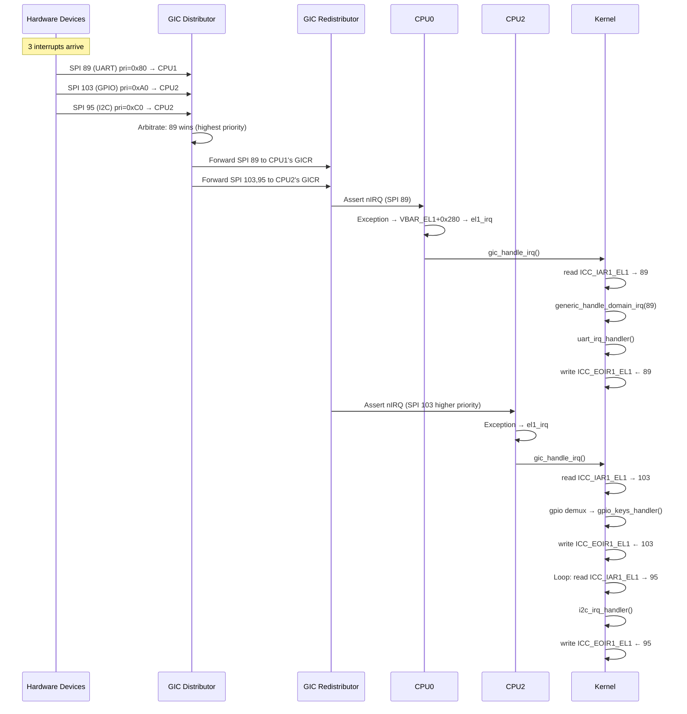

## Multiple Interrupt Selection & CPU Routing Flow

### 1. **When Multiple Interrupts Arrive Simultaneously**

The **GIC Distributor (GICD)** acts as the arbiter using this logic:

```
Multiple IRQs pending → GIC Priority Arbitration
  ↓
Step 1: Filter by ENABLED state (GICD_ISENABLERn)
Step 2: Check PENDING state (GICD_ISPENDRn)
Step 3: Compare PRIORITY values (GICD_IPRIORITYRn)
  ↓
Highest priority wins → forward to target CPU
```

**Priority Rules:**
- Lower number = higher priority (e.g., 0x00 > 0xA0 > 0xFF)
- If same priority: lowest INTID wins (hardware tie-breaker)
- Each INTID has an 8-bit priority: `GICD_IPRIORITYR<n>`

**Example Scenario:**
```
Time T=0: Three interrupts arrive:
- SPI 103 (GPIO): priority 0xA0, pending
- SPI 89 (UART): priority 0x80, pending  ← WINS (lower value)
- SPI 120 (Timer): priority 0xC0, pending

GIC forwards SPI 89 first to its target CPU
Once acknowledged, SPI 103 becomes eligible
```

---

### 2. **CPU Selection: How GIC Decides Which CPU Gets the IRQ**

For **SPIs (32-1019)**, the routing is controlled by `GICD_IROUTER<n>` (one 64-bit register per SPI):

#### **Method A: Specific CPU Targeting (IRM=0)**

```
GICD_IROUTER103 Register Layout:
┌──────────┬─────────┬─────────┬─────────┬─────────┬───────┐
│ [63:40]  │ [39:32] │ [31:24] │ [23:16] │ [15:8]  │ [7:0] │
│  Aff3    │  IRM    │  Aff2   │  Aff1   │  Aff0   │  Rsvd │
└──────────┴─────────┴─────────┴─────────┴─────────┴───────┘

If IRM=0: Route to CPU with MPIDR = Aff3.Aff2.Aff1.Aff0
```

**Example:**
```bash
# Linux sets CPU affinity:
echo 2 > /proc/irq/56/smp_affinity_list

# Kernel executes:
gic_set_affinity() {
    mpidr = cpu_logical_map(2);  // Read CPU2's MPIDR_EL1 = 0x00000002
    writeq_relaxed(mpidr, GICD_BASE + GICD_IROUTER + 103*8);
}

# Result: GICD_IROUTER103 = 0x0000000000000002
# GIC will ONLY deliver SPI 103 to CPU2
```

#### **Method B: 1-of-N Mode (IRM=1)**

```
GICD_IROUTER103 = 0x0000000100000000  // bit[31] set = IRM=1

GIC behavior:
- Distributes to ANY participating CPU in the affinity mask
- Load balances across available CPUs
- Used when Linux sets "all CPUs" affinity
```

---

### 3. **Complete Flow: Multiple Devices → Multiple CPUs**

Let's trace **3 interrupts arriving simultaneously on a 4-CPU system**:

```
Hardware State:
┌─────────────────────────────────────────────────────┐
│ GPIO (SPI 103) → priority 0xA0 → routed to CPU2     │
│ UART (SPI 89)  → priority 0x80 → routed to CPU1     │
│ I2C  (SPI 95)  → priority 0xC0 → routed to CPU2     │
└─────────────────────────────────────────────────────┘
```

#### **T=0: GIC Distributor Receives All 3**

```
GICD_ISPENDR[2] |= (1<<25);  // UART SPI 89 pending
GICD_ISPENDR[2] |= (1<<31);  // I2C SPI 95 pending
GICD_ISPENDR[3] |= (1<<7);   // GPIO SPI 103 pending

GICD checks each:
- UART: priority 0x80, target CPU1 → forward to CPU1
- GPIO: priority 0xA0, target CPU2 → forward to CPU2
- I2C:  priority 0xC0, target CPU2 → forward to CPU2 (lower priority than GPIO)
```

#### **T=1: CPU1 Handles UART (highest priority overall)**

```
CPU1:
  ICC_IAR1_EL1 read → returns 89 (UART)
  gic_handle_irq() → generic_handle_domain_irq(domain, 89)
    → handle_fasteoi_irq() → uart_irq_handler()
  ICC_EOIR1_EL1 ← 89 (EOI)
```

#### **T=2: CPU2 Handles GPIO First (priority 0xA0 > 0xC0)**

```
CPU2:
  ICC_IAR1_EL1 read → returns 103 (GPIO, higher priority than I2C)
  gic_handle_irq() → generic_handle_domain_irq(domain, 103)
    → chained demux → gpio_keys_handler()
  ICC_EOIR1_EL1 ← 103 (EOI)
```

#### **T=3: CPU2 Handles I2C Next**

```
CPU2 (still in gic_handle_irq loop):
  ICC_IAR1_EL1 read → returns 95 (I2C)
  generic_handle_domain_irq(domain, 95)
    → i2c_irq_handler()
  ICC_EOIR1_EL1 ← 95 (EOI)
```

---

### 4. **Who Decides CPU Affinity? Three Stages**

#### **Stage 1: Boot Default (GIC Driver Init)**
```c
// drivers/irqchip/irq-gic-v3.c: gic_dist_init()
for (i = 32; i < gic_data.irq_nr; i++) {
    // Set all SPIs to CPU0 by default
    writeq_relaxed(cpu_logical_map(0), 
                   base + GICD_IROUTER + i * 8);
}
```

#### **Stage 2: Driver `request_irq()` Time**
```c
// If driver specifies:
request_irq(irq, handler, IRQF_NOBALANCING, name, dev);
// → keeps default affinity

// Otherwise:
irq_setup_affinity() {
    if (irqd_affinity_is_managed(d))
        return;  // managed IRQs have pre-set affinity
    
    cpumask_and(&mask, irq_default_affinity, cpu_online_mask);
    irq_do_set_affinity(d, &mask, false);
}
```

#### **Stage 3: Runtime Tuning**
```bash
# User / IRQ balancer daemon:
echo f > /proc/irq/56/smp_affinity        # bitmask: all CPUs
echo 0-3 > /proc/irq/56/smp_affinity_list # list format
```

This calls:
```c
write_irq_affinity() → irq_set_affinity()
  → chip->irq_set_affinity() = gic_set_affinity()
    → writel_relaxed(mpidr, GICD_IROUTER + hwirq*8)
```

---

### 5. **Key Registers Summary**

| Register | What It Controls | Set By |
|---|---|---|
| **GICD_IPRIORITYRn** | Priority (0x00–0xFF per INTID) | Driver: `irq_set_priority()` (rare); default = 0xA0 |
| **GICD_IROUTERn** | Target CPU (Affinity) | Kernel: `gic_set_affinity()` via `/proc/irq/*/smp_affinity` |
| **GICD_ISENABLERn** | Enable/mask | `request_irq()` → `gic_unmask_irq()` |
| **ICC_PMR_EL1** | Priority mask threshold (per-CPU) | Usually 0xF0; masks lower-priority IRQs |
| **ICC_IAR1_EL1** | **READ = ACK** (returns INTID, moves pending→active) | `gic_handle_irq()` |

---

### 6. **Complete Sequence Diagram**



---

### 7. **Two Critical Points**

1. **Per-CPU Running Priority**: Each CPU tracks `ICC_RPR_EL1` (running priority). A new IRQ can only preempt if its priority is **strictly higher** (lower number). This prevents priority inversion.

2. **Pending vs Active**: 
   - **Pending**: IRQ waiting in GICD/GICR
   - **Active**: CPU acknowledged (read `ICC_IAR1_EL1`) but hasn't sent EOI yet
   - An IRQ can be both (pending+active) if retriggered before EOI — this is why level-sensitive IRQs must be cleared at the device before EOI

The end-to-end flow ensures multiple interrupts are handled in priority order, distributed across CPUs per affinity settings, with proper serialization via spinlocks in the Linux IRQ subsystem.